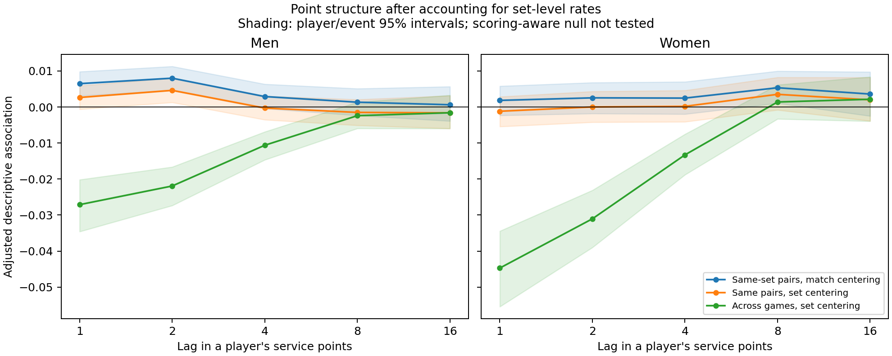

# Point structure: exploratory follow-up

This describes where observed dependence appears. Its permutation reference does not reproduce tennis scoring or stopping, so it does not establish fatigue, injury, momentum, or a physical burst duration.

Retained 1,867,212 points in 10,238 matches; no pairs bridge recorded gaps.

## Lag-one decomposition

Intervals below use both canonical-player/event memberships. Match and event intervals, all five lags, and paired differences are in results.json.

| View | Men: association [95% interval] | Women: association [95% interval] |
|---|---:|---:|
| match | +0.00654 [+0.00323, +0.00992] | +0.00189 [-0.00219, +0.00566] |
| within_set_match_centered | +0.00648 [+0.00312, +0.00981] | +0.00184 [-0.00233, +0.00580] |
| within_set_set_centered | +0.00264 [-0.00062, +0.00590] | -0.00118 [-0.00543, +0.00285] |
| within_game_set_centered | +0.00718 [+0.00367, +0.01074] | +0.00500 [+0.00046, +0.00959] |
| across_games_set_centered | -0.02711 [-0.03459, -0.02018] | -0.04471 [-0.05543, -0.03444] |
| within_set_no_tiebreak | +0.00218 [-0.00106, +0.00564] | -0.00177 [-0.00615, +0.00231] |

## Matched change after accounting for set-specific serve rates

Positive values mean the association statistic decreases after set centering. Both estimates use exactly the same pairs. This is not explained variance.

- M: +0.00384 [+0.00296, +0.00467].
- W: +0.00302 [+0.00208, +0.00394].



## Reading the evidence

Set centering uses future outcomes from the same set, so these are descriptive statistics, not out-of-sample prediction scores. Within-game and across-game pair selection can itself induce structure under iid tennis scoring. In particular, a bootstrap interval excluding zero is not a scoring-aware rejection of iid points.

Large changes after set centering motivate studying slower set-level changes and selection. Residual association between games motivates a scoring-aware null check. Neither observation identifies physiological fatigue or temporary injury. A separate prospective forecasting comparison would be required to claim predictive value.

The processed identities are canonical names with known ambiguous keys removed; the player/event bootstrap is a sensitivity analysis and does not resolve every cross-event dependency. Intervals are unadjusted exploratory comparisons.

## Reproduce

```bash
.venv-independent/bin/python analysis/point_structure_followup/analyze.py
```

Execution refuses to overwrite a completed run. Review PROTOCOL.md, FROZEN.json, audit.json, results.json and the local trials.jsonl for provenance. All new files stay in this directory; active model files and shared trial log are untouched.
