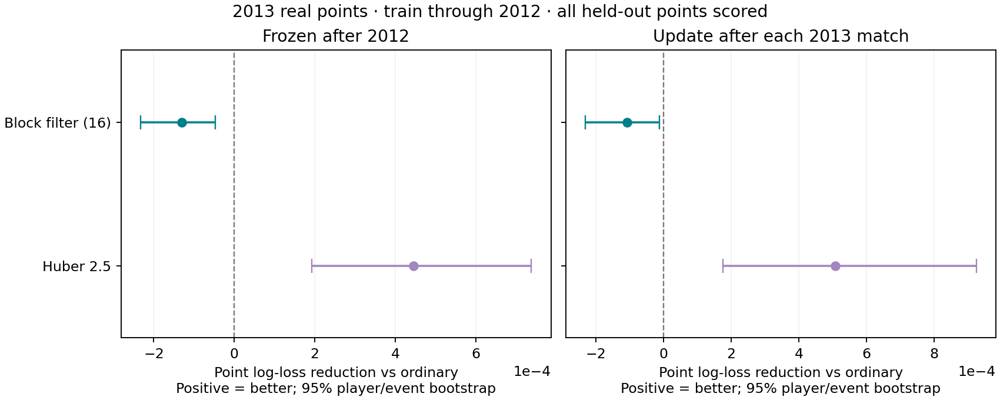

# Early real-data comparison

**Train: 2011–2012. Evaluate: 2013.** Men’s Grand Slam matches with recorded points. Drift was selected on 2012 only. This is a development read, not the untouched 2025 test.

Training: 671 matches, 145,321 points. Evaluation: 346 matches, 75,723 points. Training players: 195; unseen evaluation players: 27.

All intervals are 95% clustered bootstrap intervals. Positive paired gain means lower loss than ordinary. Point clusters are server-player/tournament; match intervals use tournaments, with only four clusters. Neither interval fully resolves all cross-player and cross-event dependencies.

## Frozen end-of-2012 abilities (primary)

No 2013 outcomes update these abilities. Every held-out point is scored, including points a robust updater would reject.

| Arm | Selected annual drift SD | Point log loss [CI] | Paired point gain [CI] | Match log loss [CI] | Match accuracy [CI] |
|---|---|---|---|---|---|
| ordinary | 0.03 | 0.65199 [0.64771, 0.65665] | 0.00000 [0.00000, 0.00000] | 0.5844 [0.4344, 0.7510] | 0.751 [0.707, 0.791] |
| huber_2.5 | 0.03 | 0.65155 [0.64730, 0.65615] | 0.00044 [0.00019, 0.00074] | 0.5609 [0.4102, 0.7281] | 0.757 [0.726, 0.786] |
| block_16 | 0.03 | 0.65212 [0.64783, 0.65676] | -0.00013 [-0.00023, -0.00005] | 0.5941 [0.4449, 0.7596] | 0.749 [0.701, 0.791] |

## Updating after each 2013 match (secondary)

Predict first, update afterward. Hyperparameters remain frozen.

| Arm | Point log loss [CI] | Paired point gain [CI] | Match log loss [CI] | Paired match gain [CI] |
|---|---|---|---|---|
| ordinary | 0.65193 [0.64768, 0.65666] | 0.00000 [0.00000, 0.00000] | 0.5959 [0.4529, 0.7547] | 0.0000 [0.0000, 0.0000] |
| huber_2.5 | 0.65143 [0.64731, 0.65597] | 0.00051 [0.00017, 0.00092] | 0.5574 [0.4148, 0.7197] | 0.0385 [0.0231, 0.0537] |
| block_16 | 0.65204 [0.64779, 0.65674] | -0.00011 [-0.00023, -0.00001] | 0.6032 [0.4600, 0.7698] | -0.0073 [-0.0176, 0.0019] |

## Point-loss sensitivity checks

| Mode | Arm | Tournament-cluster paired gain [CI] | Both players seen before 2013 [CI] | Opening round gain [CI] | Later-round gain [CI] |
|---|---|---|---|---|---|
| frozen | huber_2.5 | 0.00044 [0.00024, 0.00076] | 0.00042 [0.00016, 0.00072] | 0.00061 [0.00009, 0.00122] | 0.00035 [0.00009, 0.00064] |
| frozen | block_16 | -0.00013 [-0.00018, -0.00008] | -0.00013 [-0.00024, -0.00004] | -0.00011 [-0.00030, 0.00007] | -0.00014 [-0.00027, -0.00004] |
| online | huber_2.5 | 0.00051 [0.00023, 0.00085] | 0.00029 [0.00007, 0.00054] | 0.00032 [-0.00010, 0.00085] | 0.00062 [0.00016, 0.00121] |
| online | block_16 | -0.00011 [-0.00020, -0.00004] | -0.00011 [-0.00025, -0.00001] | -0.00009 [-0.00028, 0.00008] | -0.00012 [-0.00026, -0.00002] |

## Completed-match sensitivity

Retirements remain in point fitting and the headline scores. The following removes retirements only from match-outcome scoring, since the iid forecast has no retirement model.

| Mode | Arm | Completed-match log loss [CI] | Paired gain [CI] |
|---|---|---|---|
| frozen | ordinary | 0.5615 [0.4161, 0.7265] | 0.0000 [0.0000, 0.0000] |
| frozen | huber_2.5 | 0.5308 [0.3905, 0.6900] | 0.0307 [0.0162, 0.0394] |
| frozen | block_16 | 0.5695 [0.4280, 0.7301] | -0.0080 [-0.0119, -0.0037] |
| online | ordinary | 0.5723 [0.4402, 0.7222] | 0.0000 [0.0000, 0.0000] |
| online | huber_2.5 | 0.5276 [0.3987, 0.6739] | 0.0446 [0.0326, 0.0562] |
| online | block_16 | 0.5794 [0.4483, 0.7281] | -0.0071 [-0.0166, 0.0015] |

## Filtering activity

- training_2011_2012: rejected 248/145,321 observed points in 14/671 matches. These are filter decisions, not confirmed contamination.
- online_updates_2013: rejected 224/75,723 observed points in 11/346 matches. These are filter decisions, not confirmed contamination.

## Data and interpretation limits

Point coverage is incomplete and favors recorded courts. These are point-corpus-only fits, not models trained on every ATP match. ATP records supply stable identities and match metadata; they are not extra ability observations. Full-name aliases and per-file SHA-256 checks are recorded in audit.json.

Matches follow verified bracket rounds. Tournament start dates govern diffusion because exact match dates are absent; there is no within-event diffusion. Missing-point gaps split blocks. Recorded point counts may differ from ATP serve totals; the audit preserves those discrepancies, and no outcomes are imputed.

The block filter now conditions on actual unequal service opportunities and uses a point-count rejection budget. The Huber and ordinary arms share its observation cohort and underlying approximate ability model. A better held-out forecast would not by itself prove that temporary impairment was removed. Conversely, a small or negative forecasting effect does not identify the true latent skill error.

Match forecasts are the same iid scoring recursion in all arms with historical deciding-set rules. This isolates estimation, rather than testing the final per-arm-tuned burst simulator. See [protocol](../../docs/POINT_ROBUST_EARLY_REAL.md).

Full paired predictions: `point_predictions.csv`, `match_predictions.csv`. Training snapshots: `abilities_2012.csv`. Filters: `block_diagnostics.json`. Tuning, intervals and source hashes: `results.json`.
