# Consolidated result figures

Generated from saved development artifacts; no model refits and no 2025 outcomes.

The later frozen 2025 ordinary-model holdout is reported separately because it
was run after these development-only figures were generated:

- [`independent_2025/README.md`](../../independent_2025/README.md)
- [`independent_2025/ordinary_2025_holdout.png`](../../independent_2025/ordinary_2025_holdout.png)
- [`independent_2025/ONLINE_README.md`](../../independent_2025/ONLINE_README.md)
- [`independent_2025/online_2025_updates.png`](../../independent_2025/online_2025_updates.png)

## Current evidence

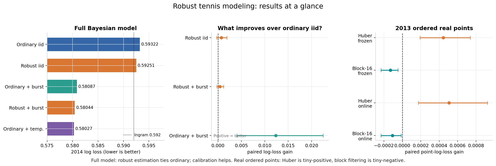

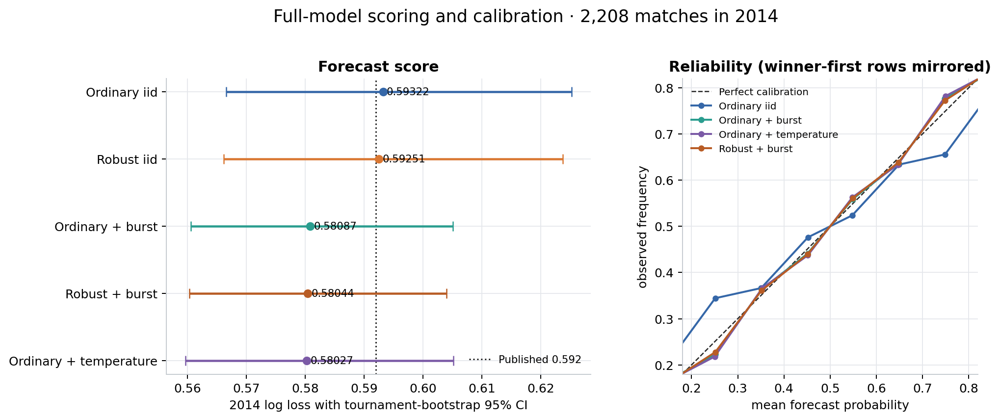

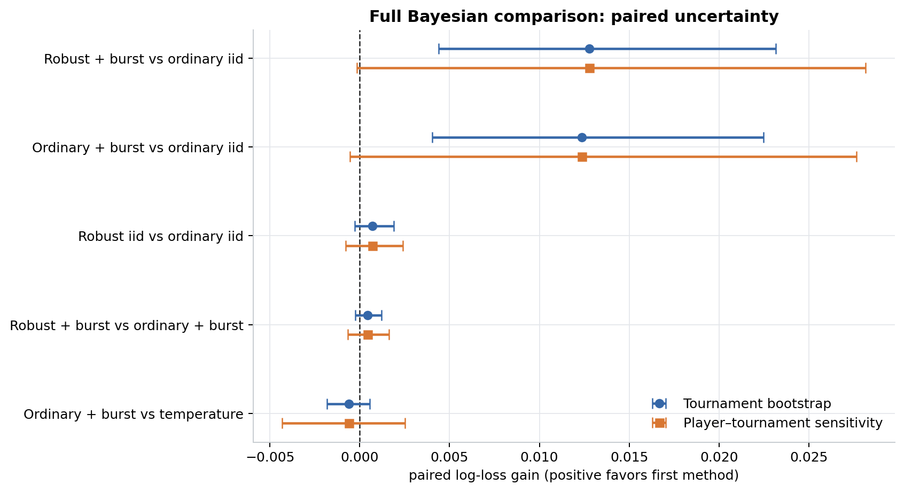

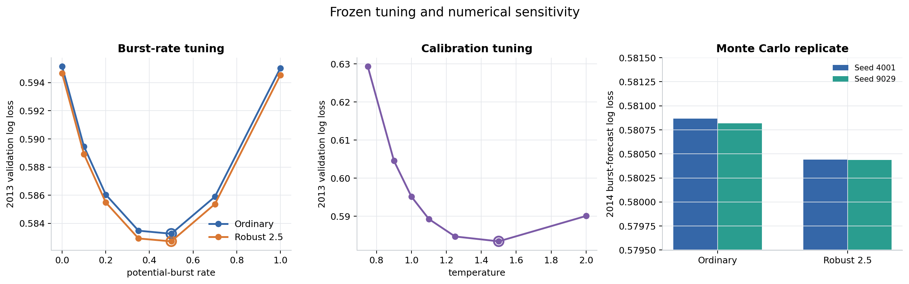

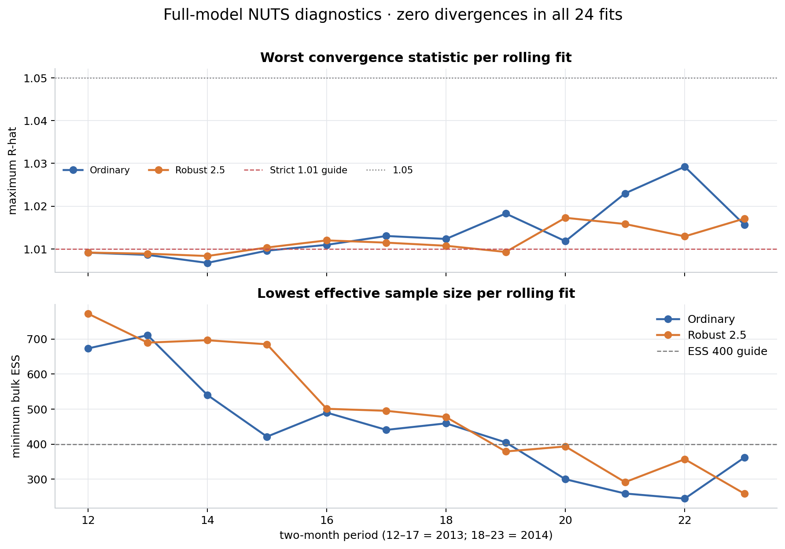

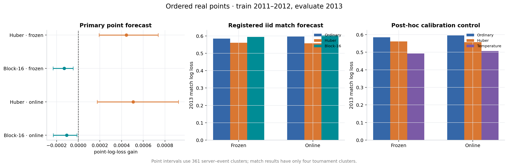

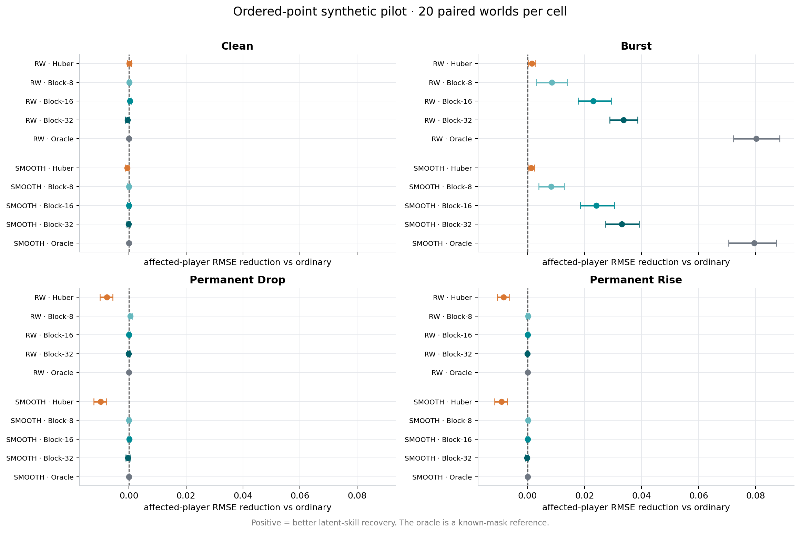

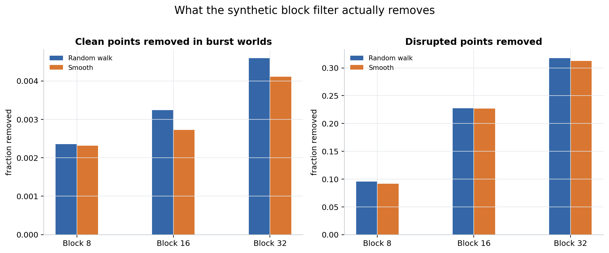

## Provenance and failed checks

The older simplified online-filter results are retained for provenance and are
superseded by the full Bayesian comparison.

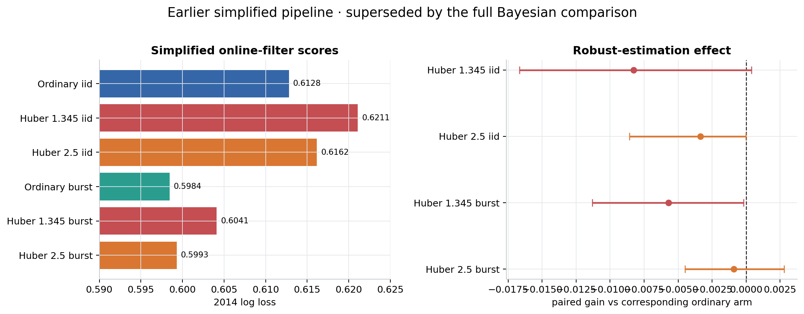

The separate two-seed Bayesian synthetic recovery run failed its sampler
diagnostics. Its RMSE differences are deliberately not plotted as evidence.

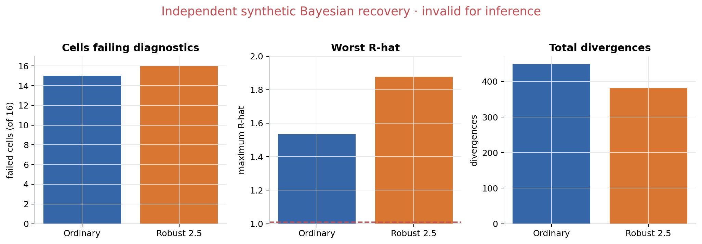

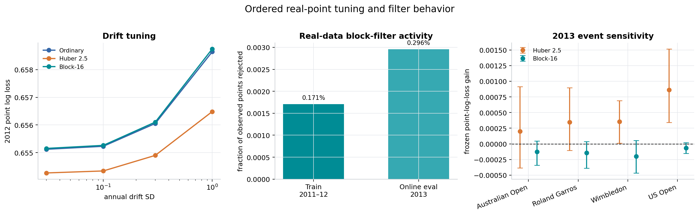

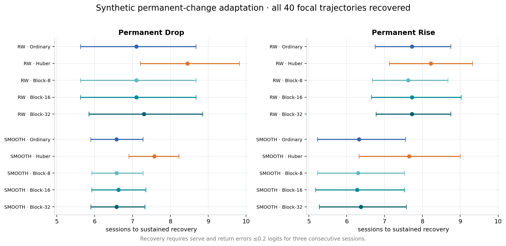

Existing detailed figures remain available:

- [`point_robust_pilot/trajectories.png`](../../point_robust_pilot/trajectories.png)
- [`point_robust_pilot/block_weights.png`](../../point_robust_pilot/block_weights.png)
- [`early_real_2013/point_gains.png`](../../early_real_2013/point_gains.png)
- [`plots/skill_trajectories.png`](../skill_trajectories.png)
- [`plots/alpha_by_surface.png`](../alpha_by_surface.png)
- [`plots/tuning_grids.png`](../tuning_grids.png)
- [`plots/season_scores.png`](../season_scores.png)

Primary numerical sources: [`independent/comparison.json`](../../independent/comparison.json),
[`early_real_2013/results.json`](../../early_real_2013/results.json), and
[`point_robust_pilot/results.json`](../../point_robust_pilot/results.json).
