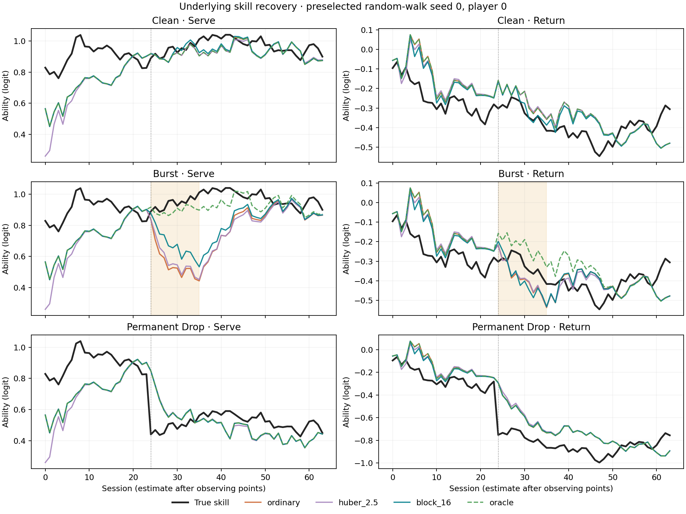
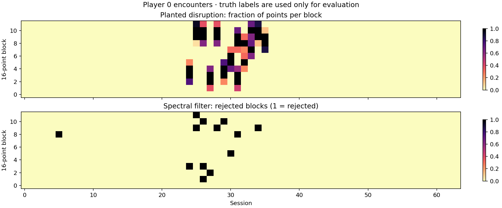

# Ordered-point robustness pilot

Generated 2026-09-22T07:33:28+00:00; 20 paired seeds per cell.

Exploratory mechanism experiment; no real data or 2025 test used. Settings were fixed before execution; no block size is selected as a winner. See [design](../../docs/POINT_ROBUST_PILOT.md).

RMSE is in ability logits, after fixing only the shared serve/return offset. Evaluation starts at session 24. Focal = players 0 and 1; others = remaining players. Positive paired gain means lower RMSE than ordinary. Intervals are 95% paired world-bootstrap intervals (Monte Carlo uncertainty, not real-data confidence).

## Ability recovery

| Truth | Condition | Arm | Focal RMSE [CI] | Focal gain [CI] | Other-player RMSE [CI] | Other-player gain [CI] |
|---|---|---|---|---|---|---|
| rw | clean | ordinary | 0.0897 [0.0849, 0.0949] | 0.0000 [0.0000, 0.0000] | 0.0921 [0.0877, 0.0964] | 0.0000 [0.0000, 0.0000] |
| rw | clean | huber_2.5 | 0.0895 [0.0847, 0.0949] | 0.0001 [-0.0006, 0.0008] | 0.0922 [0.0877, 0.0964] | -0.0001 [-0.0005, 0.0001] |
| rw | clean | block_8 | 0.0895 [0.0848, 0.0947] | 0.0002 [-0.0002, 0.0005] | 0.0922 [0.0878, 0.0967] | -0.0002 [-0.0004, 0.0001] |
| rw | clean | block_16 | 0.0894 [0.0846, 0.0946] | 0.0003 [-0.0001, 0.0008] | 0.0922 [0.0879, 0.0965] | -0.0001 [-0.0003, 0.0000] |
| rw | clean | block_32 | 0.0902 [0.0854, 0.0953] | -0.0005 [-0.0012, 0.0001] | 0.0925 [0.0880, 0.0968] | -0.0004 [-0.0008, -0.0001] |
| rw | clean | oracle | 0.0897 [0.0849, 0.0949] | 0.0000 [0.0000, 0.0000] | 0.0921 [0.0877, 0.0964] | 0.0000 [0.0000, 0.0000] |
| rw | burst | ordinary | 0.1717 [0.1613, 0.1812] | 0.0000 [0.0000, 0.0000] | 0.1051 [0.1007, 0.1093] | 0.0000 [0.0000, 0.0000] |
| rw | burst | huber_2.5 | 0.1702 [0.1598, 0.1797] | 0.0015 [0.0001, 0.0028] | 0.1052 [0.1006, 0.1094] | -0.0001 [-0.0005, 0.0004] |
| rw | burst | block_8 | 0.1632 [0.1532, 0.1719] | 0.0085 [0.0030, 0.0140] | 0.1042 [0.0998, 0.1085] | 0.0009 [-0.0001, 0.0020] |
| rw | burst | block_16 | 0.1486 [0.1394, 0.1576] | 0.0230 [0.0177, 0.0292] | 0.1013 [0.0970, 0.1055] | 0.0039 [0.0026, 0.0052] |
| rw | burst | block_32 | 0.1380 [0.1289, 0.1467] | 0.0336 [0.0288, 0.0387] | 0.1004 [0.0961, 0.1048] | 0.0047 [0.0033, 0.0062] |
| rw | burst | oracle | 0.0915 [0.0864, 0.0968] | 0.0802 [0.0723, 0.0885] | 0.0932 [0.0888, 0.0976] | 0.0119 [0.0101, 0.0138] |
| rw | permanent_drop | ordinary | 0.1413 [0.1330, 0.1491] | 0.0000 [0.0000, 0.0000] | 0.1006 [0.0971, 0.1042] | 0.0000 [0.0000, 0.0000] |
| rw | permanent_drop | huber_2.5 | 0.1490 [0.1400, 0.1576] | -0.0077 [-0.0102, -0.0056] | 0.1022 [0.0985, 0.1059] | -0.0015 [-0.0021, -0.0010] |
| rw | permanent_drop | block_8 | 0.1408 [0.1326, 0.1485] | 0.0005 [0.0000, 0.0011] | 0.1005 [0.0971, 0.1041] | 0.0001 [-0.0002, 0.0003] |
| rw | permanent_drop | block_16 | 0.1413 [0.1330, 0.1490] | 0.0000 [-0.0003, 0.0004] | 0.1007 [0.0972, 0.1043] | -0.0001 [-0.0003, 0.0001] |
| rw | permanent_drop | block_32 | 0.1414 [0.1332, 0.1492] | -0.0001 [-0.0006, 0.0003] | 0.1009 [0.0973, 0.1045] | -0.0002 [-0.0007, 0.0002] |
| rw | permanent_drop | oracle | 0.1413 [0.1330, 0.1491] | 0.0000 [0.0000, 0.0000] | 0.1006 [0.0971, 0.1042] | 0.0000 [0.0000, 0.0000] |
| rw | permanent_rise | ordinary | 0.1513 [0.1430, 0.1605] | 0.0000 [0.0000, 0.0000] | 0.1022 [0.0987, 0.1056] | 0.0000 [0.0000, 0.0000] |
| rw | permanent_rise | huber_2.5 | 0.1598 [0.1503, 0.1704] | -0.0084 [-0.0106, -0.0065] | 0.1039 [0.1002, 0.1074] | -0.0016 [-0.0023, -0.0011] |
| rw | permanent_rise | block_8 | 0.1512 [0.1427, 0.1606] | 0.0001 [-0.0005, 0.0006] | 0.1023 [0.0989, 0.1057] | -0.0001 [-0.0003, 0.0001] |
| rw | permanent_rise | block_16 | 0.1512 [0.1428, 0.1604] | 0.0001 [-0.0001, 0.0004] | 0.1023 [0.0989, 0.1056] | -0.0001 [-0.0003, 0.0001] |
| rw | permanent_rise | block_32 | 0.1514 [0.1432, 0.1605] | -0.0001 [-0.0003, 0.0001] | 0.1024 [0.0988, 0.1058] | -0.0002 [-0.0006, 0.0001] |
| rw | permanent_rise | oracle | 0.1513 [0.1430, 0.1605] | 0.0000 [0.0000, 0.0000] | 0.1022 [0.0987, 0.1056] | 0.0000 [0.0000, 0.0000] |
| smooth | clean | ordinary | 0.0759 [0.0703, 0.0821] | 0.0000 [0.0000, 0.0000] | 0.0784 [0.0753, 0.0814] | 0.0000 [0.0000, 0.0000] |
| smooth | clean | huber_2.5 | 0.0766 [0.0708, 0.0829] | -0.0006 [-0.0013, -0.0001] | 0.0786 [0.0754, 0.0817] | -0.0002 [-0.0007, 0.0002] |
| smooth | clean | block_8 | 0.0760 [0.0702, 0.0824] | -0.0001 [-0.0005, 0.0004] | 0.0784 [0.0752, 0.0814] | 0.0000 [-0.0002, 0.0003] |
| smooth | clean | block_16 | 0.0759 [0.0702, 0.0823] | -0.0000 [-0.0006, 0.0005] | 0.0787 [0.0754, 0.0817] | -0.0003 [-0.0006, 0.0000] |
| smooth | clean | block_32 | 0.0760 [0.0703, 0.0823] | -0.0001 [-0.0007, 0.0004] | 0.0787 [0.0756, 0.0817] | -0.0003 [-0.0007, 0.0001] |
| smooth | clean | oracle | 0.0759 [0.0703, 0.0821] | 0.0000 [0.0000, 0.0000] | 0.0784 [0.0753, 0.0814] | 0.0000 [0.0000, 0.0000] |
| smooth | burst | ordinary | 0.1581 [0.1507, 0.1652] | 0.0000 [0.0000, 0.0000] | 0.0927 [0.0898, 0.0961] | 0.0000 [0.0000, 0.0000] |
| smooth | burst | huber_2.5 | 0.1568 [0.1495, 0.1638] | 0.0013 [0.0004, 0.0023] | 0.0922 [0.0892, 0.0956] | 0.0005 [-0.0000, 0.0010] |
| smooth | burst | block_8 | 0.1498 [0.1423, 0.1571] | 0.0083 [0.0039, 0.0128] | 0.0909 [0.0877, 0.0942] | 0.0018 [0.0006, 0.0029] |
| smooth | burst | block_16 | 0.1340 [0.1242, 0.1435] | 0.0241 [0.0186, 0.0303] | 0.0883 [0.0849, 0.0918] | 0.0044 [0.0032, 0.0058] |
| smooth | burst | block_32 | 0.1250 [0.1157, 0.1335] | 0.0331 [0.0273, 0.0391] | 0.0866 [0.0832, 0.0900] | 0.0061 [0.0045, 0.0078] |
| smooth | burst | oracle | 0.0786 [0.0729, 0.0850] | 0.0795 [0.0705, 0.0873] | 0.0789 [0.0756, 0.0822] | 0.0138 [0.0121, 0.0154] |
| smooth | permanent_drop | ordinary | 0.1330 [0.1277, 0.1386] | 0.0000 [0.0000, 0.0000] | 0.0881 [0.0849, 0.0913] | 0.0000 [0.0000, 0.0000] |
| smooth | permanent_drop | huber_2.5 | 0.1429 [0.1367, 0.1492] | -0.0099 [-0.0123, -0.0078] | 0.0895 [0.0863, 0.0926] | -0.0014 [-0.0021, -0.0008] |
| smooth | permanent_drop | block_8 | 0.1330 [0.1277, 0.1385] | -0.0000 [-0.0004, 0.0004] | 0.0880 [0.0847, 0.0914] | 0.0000 [-0.0002, 0.0003] |
| smooth | permanent_drop | block_16 | 0.1329 [0.1276, 0.1386] | 0.0001 [-0.0004, 0.0006] | 0.0883 [0.0849, 0.0917] | -0.0003 [-0.0007, 0.0002] |
| smooth | permanent_drop | block_32 | 0.1333 [0.1280, 0.1387] | -0.0003 [-0.0011, 0.0004] | 0.0884 [0.0851, 0.0917] | -0.0003 [-0.0006, 0.0000] |
| smooth | permanent_drop | oracle | 0.1330 [0.1277, 0.1386] | 0.0000 [0.0000, 0.0000] | 0.0881 [0.0849, 0.0913] | 0.0000 [0.0000, 0.0000] |
| smooth | permanent_rise | ordinary | 0.1326 [0.1240, 0.1416] | 0.0000 [0.0000, 0.0000] | 0.0900 [0.0868, 0.0932] | 0.0000 [0.0000, 0.0000] |
| smooth | permanent_rise | huber_2.5 | 0.1417 [0.1323, 0.1515] | -0.0091 [-0.0115, -0.0070] | 0.0912 [0.0879, 0.0946] | -0.0012 [-0.0024, -0.0002] |
| smooth | permanent_rise | block_8 | 0.1324 [0.1238, 0.1415] | 0.0002 [-0.0001, 0.0006] | 0.0899 [0.0868, 0.0932] | 0.0000 [-0.0001, 0.0002] |
| smooth | permanent_rise | block_16 | 0.1325 [0.1239, 0.1415] | 0.0001 [-0.0003, 0.0004] | 0.0901 [0.0870, 0.0933] | -0.0001 [-0.0003, 0.0000] |
| smooth | permanent_rise | block_32 | 0.1328 [0.1243, 0.1417] | -0.0003 [-0.0008, 0.0002] | 0.0905 [0.0874, 0.0936] | -0.0005 [-0.0010, -0.0001] |
| smooth | permanent_rise | oracle | 0.1326 [0.1240, 0.1416] | 0.0000 [0.0000, 0.0000] | 0.0900 [0.0868, 0.0932] | 0.0000 [0.0000, 0.0000] |

## Removed point fractions

These describe explicit data rejection. Huber clips scores and does not remove points.

| Truth | Condition | Arm | Clean points removed [CI] | Disrupted points removed [CI] |
|---|---|---|---|---|
| rw | clean | block_8 | 0.0007 [0.0005, 0.0008] | — |
| rw | clean | block_16 | 0.0011 [0.0008, 0.0015] | — |
| rw | clean | block_32 | 0.0023 [0.0017, 0.0029] | — |
| rw | burst | block_8 | 0.0024 [0.0020, 0.0027] | 0.0957 [0.0751, 0.1174] |
| rw | burst | block_16 | 0.0032 [0.0028, 0.0038] | 0.2273 [0.2066, 0.2513] |
| rw | burst | block_32 | 0.0046 [0.0039, 0.0053] | 0.3175 [0.2992, 0.3375] |
| smooth | clean | block_8 | 0.0006 [0.0004, 0.0007] | — |
| smooth | clean | block_16 | 0.0012 [0.0009, 0.0014] | — |
| smooth | clean | block_32 | 0.0020 [0.0016, 0.0026] | — |
| smooth | burst | block_8 | 0.0023 [0.0019, 0.0027] | 0.0916 [0.0705, 0.1154] |
| smooth | burst | block_16 | 0.0027 [0.0022, 0.0033] | 0.2271 [0.1943, 0.2617] |
| smooth | burst | block_32 | 0.0041 [0.0034, 0.0049] | 0.3125 [0.2794, 0.3455] |

## Sustained-change adaptation

Recovery = both ability errors ≤0.2 logits for three consecutive sessions. Lag counts from the change to the start of that run. Non-recovery is censored; mean lag is conditional on recovery and must be read with recovery fraction.

| Truth | Change | Arm | Recovered / total | Recovery fraction [CI] | Lag among recovered [CI] |
|---|---|---|---|---|---|
| rw | permanent_drop | ordinary | 40 / 40 | 1.0000 [1.0000, 1.0000] | 7.1000 [5.6250, 8.6750] |
| rw | permanent_drop | huber_2.5 | 40 / 40 | 1.0000 [1.0000, 1.0000] | 8.4500 [7.2000, 9.8250] |
| rw | permanent_drop | block_8 | 40 / 40 | 1.0000 [1.0000, 1.0000] | 7.1000 [5.6250, 8.6750] |
| rw | permanent_drop | block_16 | 40 / 40 | 1.0000 [1.0000, 1.0000] | 7.1000 [5.6250, 8.6750] |
| rw | permanent_drop | block_32 | 40 / 40 | 1.0000 [1.0000, 1.0000] | 7.3000 [5.8500, 8.8500] |
| rw | permanent_drop | oracle | 40 / 40 | 1.0000 [1.0000, 1.0000] | 7.1000 [5.6250, 8.6750] |
| rw | permanent_rise | ordinary | 40 / 40 | 1.0000 [1.0000, 1.0000] | 7.7250 [6.7500, 8.7500] |
| rw | permanent_rise | huber_2.5 | 40 / 40 | 1.0000 [1.0000, 1.0000] | 8.2250 [7.1250, 9.3250] |
| rw | permanent_rise | block_8 | 40 / 40 | 1.0000 [1.0000, 1.0000] | 7.6250 [6.6750, 8.6750] |
| rw | permanent_rise | block_16 | 40 / 40 | 1.0000 [1.0000, 1.0000] | 7.7250 [6.6500, 9.0250] |
| rw | permanent_rise | block_32 | 40 / 40 | 1.0000 [1.0000, 1.0000] | 7.7250 [6.7750, 8.7506] |
| rw | permanent_rise | oracle | 40 / 40 | 1.0000 [1.0000, 1.0000] | 7.7250 [6.7500, 8.7500] |
| smooth | permanent_drop | ordinary | 40 / 40 | 1.0000 [1.0000, 1.0000] | 6.5750 [5.9000, 7.2756] |
| smooth | permanent_drop | huber_2.5 | 40 / 40 | 1.0000 [1.0000, 1.0000] | 7.5750 [6.9000, 8.2250] |
| smooth | permanent_drop | block_8 | 40 / 40 | 1.0000 [1.0000, 1.0000] | 6.5750 [5.9250, 7.2750] |
| smooth | permanent_drop | block_16 | 40 / 40 | 1.0000 [1.0000, 1.0000] | 6.6250 [5.9250, 7.3500] |
| smooth | permanent_drop | block_32 | 40 / 40 | 1.0000 [1.0000, 1.0000] | 6.5750 [5.9000, 7.3250] |
| smooth | permanent_drop | oracle | 40 / 40 | 1.0000 [1.0000, 1.0000] | 6.5750 [5.9000, 7.2756] |
| smooth | permanent_rise | ordinary | 40 / 40 | 1.0000 [1.0000, 1.0000] | 6.3250 [5.2250, 7.5500] |
| smooth | permanent_rise | huber_2.5 | 40 / 40 | 1.0000 [1.0000, 1.0000] | 7.6500 [6.3250, 9.0000] |
| smooth | permanent_rise | block_8 | 40 / 40 | 1.0000 [1.0000, 1.0000] | 6.3000 [5.2250, 7.5250] |
| smooth | permanent_rise | block_16 | 40 / 40 | 1.0000 [1.0000, 1.0000] | 6.2750 [5.1744, 7.5250] |
| smooth | permanent_rise | block_32 | 40 / 40 | 1.0000 [1.0000, 1.0000] | 6.3750 [5.2750, 7.5750] |
| smooth | permanent_rise | oracle | 40 / 40 | 1.0000 [1.0000, 1.0000] | 6.3250 [5.2250, 7.5500] |

## Preselected illustration

Random-walk seed 0, player 0, block size 16; chosen before execution. All three block sizes remain in the tables above.

## Limits

This tests within-encounter heterogeneity. A uniformly impaired encounter can look like a genuine level change. Short or weak bursts may be undetectable. The spectral prefilter is SEVER-inspired, not published SEVER/MMW, and carries no inherited arbitrary-contamination guarantee. Its clean calibration assumes independent, constant-probability points within each service stream. Natural dependence could trigger rejection on real data.

All arms retain the existing approximate online ability backbone. The pilot uses balanced service sequences and fixed encounter lengths, with no scoring, bracket selection, surface changes or missingness. It does not validate the full tennis pipeline. The oracle is a known-mask reference, not a guaranteed finite-sample error bound. Individual-player results and all seed-level metrics are in results.json; raw fitted trajectories are in trajectories.npz.
