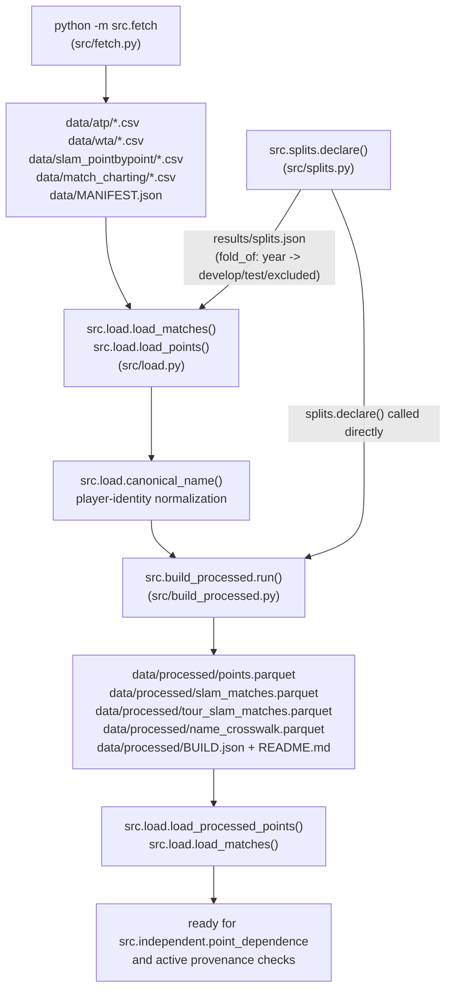

# Data pipeline

**Scope update (2026-09-22):** this document describes the shared/legacy
processed-data pipeline. The full Bayesian reproduction reads its separately
pinned author fixture through `src/independent/bayes.py`; the 2025 runner uses
`src/independent/run_2025.py::load_extended`, verified ATP source files and
stable ATP IDs. The frozen-protocol WTA runner performs the analogous WTA load;
its corrected implementation also enforces the written team-event exclusion.
See the [results map](../results/README.md) for the active workflows and
[current status](../STATUS.md) for the already-completed 2025 holdout.

*A walkthrough of everything that happens between "empty `data/` directory"
and "analysis-ready, harmonized DataFrame / parquet." This covers
`fetch → load → build_processed` (with `splits` as a side declaration feeding
both) only — not the ability model, the reproduction of Ingram, or the audit
stage that consume this output. Those are covered by `STATUS.md` and
`README.md`, not here.*

## Overview

The active design uses ATP and WTA match-level results for the full
Ingram-style ability model and uses Grand Slam point data to measure
within-match serial association and per-set dispersion directly. Earlier
contamination detection, robust estimation, hybrid likelihood, and service
block branches are archived under `archive/`.

Three modules do the current work, in strict order: `src/fetch.py` downloads
and hash-verifies the raw corpus into `data/` (never committed to git, and
widened to a 2000–2026 window so there's enough ATP history for the
random-walk ability model, the 2014 Ingram reproduction, development through
2024, and the 2025 test season); `src/load.py` reads both the ATP/WTA
match-level CSVs and the slam point-by-point CSVs, harmonizes their schemas,
and — new in this design — normalizes player identity through
`canonical_name()` so a player isn't fragmented across years or corpora;
`src/build_processed.py` materializes a derived, regenerable analysis layer
under `data/processed/` (parquet + a generated data dictionary) so nothing
downstream has to re-derive the harmonization or re-hit the name-fragmentation
bug. `src/splits.py` sits to the side of this chain: it declares the
develop/test boundary once, durably, and both `load.py` (per-row fold
labeling) and `build_processed.py` (which calls `splits.declare()` directly)
depend on it. `src/util.py` is shared plumbing (atomic JSON writes,
append-only logs), not a pipeline stage.

The dominant theme carried over from the old design is unchanged: **provenance
and non-random missingness are first-class facts, not swept under the rug.**
Every fetched byte is still hash-verified against `MANIFEST.json`, optional
columns are still carried as reduced-covariate rather than dropped, and the
processed layer's job is to make the one genuinely new problem in this
design — cross-year, cross-corpus name fragmentation — visible and curated
rather than silently merged.

## Pipeline flow



Execution order in practice:

1. `python -m src.fetch` — populate `data/` (once; re-run is idempotent).
2. `src.splits.declare()` — write `results/splits.json` (once, ever; called
   internally by both `load.py` and `build_processed.py`, not normally run
   standalone).
3. `src.load.load_matches(...)` / `src.load.load_points(...)` — read CSVs,
   harmonize, canonicalize names, tag with fold.
4. `python -m src.build_processed` — materialize the derived parquet layer
   under `data/processed/`, curate name collisions, write `BUILD.json` +
   `README.md`.
5. Downstream code prefers `src.load.load_processed_points()` /
   `src.load.load_matches()` over re-deriving from raw.

---

## 1. Fetch — `src/fetch.py`

### What it does

`src/fetch.py` is, per its own docstring, **"the only sanctioned way data
enters the project."** It downloads four data groups into `data/` and writes
`data/MANIFEST.json` recording exactly what was fetched, from where, and its
SHA-256.

The four groups (`GROUPS` dict, fetch.py:181–190):

| Group | Contents | Role |
|---|---|---|
| `atp` | Men's match results, rankings, players | Ingram-model development and ATP 2025 evaluation |
| `slam` | Grand Slam point-by-point `*-points.csv` + `*-matches.csv` | Direct within-match dependence measurement |
| `wta` | Women's equivalent match results | Frozen WTA 2025 protocol and documented correction |
| `mcp` | Match Charting Project shot-by-shot | Archived exploratory source; retained in the corpus |

This is a description of current use, not a change to the fetch groups.

Run it with:

```bash
python -m src.fetch                 # fetch every group
python -m src.fetch slam atp        # fetch a subset
python -m src.fetch --list          # show the file plan without downloading
python -m src.fetch --verify        # re-hash local files against MANIFEST; hard stop on mismatch
python -m src.fetch --source hf     # fetch via the Hugging Face fallback
```

### Why: the provenance problem

The three JeffSackmann repos named in the project spec
(`tennis_slam_pointbypoint`, `tennis_atp`, `tennis_wta`) **return 404 as of
September 2026** (fetch.py:19–27). `slam`/`atp`/`wta` are instead pulled from
an archival mirror, `Aneeshers/tennis-sackmann-archive`, pinned to a full
40-character commit SHA (`MIRROR_SHA`, fetch.py:77):
`83733587353df8a41f2fd4f516147d5aa83f5a8d`, recorded as verified against the
mirror's live `main` HEAD as of 2026-09-20 (fetch.py:73–75). The Match
Charting Project is still live upstream and is pulled directly from
JeffSackmann, pinned to its own SHA (`MCP_SHA`, fetch.py:79):
`1813a1309b7ed7ebf1c7e884b32bf675d00e4edf`.

This matters because **the mirror is an archive, not a fork** — it shares no
git history with the original repos, so its contents can't be diffed against
what upstream actually published. A commit pin to a third party isn't
self-verifying if that third party also disappears. So the script's real
integrity anchor is not the commit pin — it's a **SHA-256 recorded per file**
in `data/MANIFEST.json`, checked before the file is trusted. A guard at
import time (fetch.py:192–198) asserts `slam`/`atp`/`wta` always come from
the mirror repo, so an edit that accidentally re-points at a dead
`JeffSackmann/...` URL fails loudly instead of silently breaking provenance.

Provenance quality is **uneven and the code says so** (the `SOURCES` dict,
fetch.py:89–126, written verbatim into the manifest): `slam` names its
upstream commit (`6febb77`, abbreviated because the full SHA is unrecoverable
now that upstream is gone) — rated `"good"`. `atp` and `wta` are a June 2026
snapshot with **no recorded upstream commit** — rated `"WEAK — ... trust
risk"`. `mcp` is pinned directly to a live upstream commit — `"good"`. This
matters because the match-level ATP and WTA evaluations use the sources with
weaker upstream provenance. Per-file SHA-256 checks therefore carry more
evidential weight for them than for `slam`.

### The `--verify` hard stop

`fetch_group()` (fetch.py:271–317) and `verify()` (fetch.py:320–350) both
treat a hash mismatch as fatal, never a warning:

- On a fresh download, if the manifest already has a recorded hash for that
  path and the newly-downloaded bytes don't match it, `fetch_group` raises
  `SystemExit` — "Hard stop" (fetch.py:301–304).
- If a file already exists on disk at the expected size, it's re-hashed and
  compared against the manifest; a mismatch also raises `SystemExit` rather
  than silently re-trusting stale bytes (fetch.py:287–295). This is also what
  makes fetch **idempotent**: a file already present whose hash matches is
  skipped, so a partial run resumes cleanly.
- `python -m src.fetch --verify` re-hashes *every* file in the manifest
  against its recorded SHA-256, independent of any download. Any mismatch or
  missing file returns exit code 1 (fetch.py:344–348) — this is meant to be
  run any time you want to trust what's on disk (e.g., before a long modeling
  run).

### The Hugging Face fallback

`HF_REPO`/`HF_REVISION` (fetch.py:83–84) point at the same archive mirrored
on the Hugging Face Hub. It's a **second fallback**, reachable via
`--source hf`, but it's "usable ONLY when its bytes reproduce our recorded
hashes" (fetch.py:33–34) — i.e., it goes through the exact same hash-check
path as the GitHub download, so switching source never silently swaps in
different data. `mcp` has no HF fallback (`_url_for`, fetch.py:246–247) since
the charting project isn't in that archive.

### Singles-only filtering and the widened match window

The slam directory mixes singles, `-doubles`, and `-mixed` files.
`_is_slam_singles()` (fetch.py:146–151) explicitly excludes anything with
`"doubles"` or `"mixed"` in the name and only keeps files matching
`20\d\d-\w+-(points|matches)\.csv` (plus the data dictionary and upstream
README) — so a later accidental glob can't pull in doubles data.
`_is_tour_window()` (fetch.py:154–169) does the analogous job for
`atp`/`wta`: it excludes `_doubles_`, `_futures_`, `_qual_chall_`, and
`_amateur_` files, and restricts `atp_matches_YYYY.csv` /
`wta_matches_YYYY.csv` (plus players/rankings files) to
`WINDOW = range(2000, 2027)` (fetch.py:132).

This window is **new to the current design and wider than the old one**: the
old contamination-detection design windowed ATP/WTA to 2011–2024 to match the
slam corpus exactly. The current design needs more ATP history than that —
enough runway before 2014 for the random-walk ability model to warm up before
the Ingram reproduction year, enough through 2024 for development, and 2025
itself for the single-use test season — so the window was widened to
2000–2026 (2026 is present in the mirror but partial, and is excluded by
`splits.fold_of` as `"excluded"`, not folded into develop or test). The slam
point-by-python corpus is still filtered by filename pattern rather than this
window, since it only runs 2011–2024 regardless.

### Provenance/licensing output

Every successful fetch writes three files into `data/`
(`write_provenance()`, fetch.py:353–386):

- **`MANIFEST.json`** — generation timestamp, the pinned SHAs, per-group
  `SOURCES` metadata, explicit `provenance_notes` (archive-not-fork, weak
  atp/wta provenance, "keep an independent cold copy," and the frozen-dataset
  note), and a `files` list with one record per file: group, relative path,
  size, SHA-256, source, and both the GitHub and HF URLs it could have come
  from. As of the last fetch recorded in the repo, `data/MANIFEST.json`
  reports 169 files totaling ~498 MB across all four groups.
- **`ATTRIBUTION.txt`** and **`DATA_LICENSE.txt`** — the CC BY-NC-SA 4.0
  attribution text (Jeff Sackmann as compiler, non-commercial only,
  share-alike) and full license summary, written verbatim
  (fetch.py:389–434). The grant is irrevocable, so using the archived copies
  is legitimate even though upstream is gone.

`data/` itself is **gitignored** — nothing under it is ever committed; this is
enforced by `.gitignore`, not by the fetch script, but the fetch script's
docstring calls this out as the reason hashes/manifests matter so much
(fetch.py:3–6).

---

## 2. Load — `src/load.py`

### What it does

`src/load.py` is a dual-purpose module: it loads **ATP/WTA match-level data**
(`load_matches`) and the **Slam point-by-point** corpus (`load_points` /
`load_processed_points`). Both paths route player identity through the same
`canonical_name()` function.

```bash
python -c "from src import load; df = load.load_matches(tour='M'); print(df.shape)"
python -c "from src import load; df = load.load_points(folds=('develop',)); print(df.shape)"
```

### `canonical_name(name)` — the new normalization layer (load.py:46–71)

This is the piece that didn't exist in the old design. The slam point-by-point
files switched from full names ("Dominic Thiem", used ~2011–2018) to
initial+surname ("D. Thiem", ~2019+), which fragments a player across years
*and* breaks any name-based join between the slam corpus and ATP/WTA. Because
neither the slam matches files nor (usably) the ATP/WTA files carry a stable
player ID that's consistent across sources, identity has to be reconstructed
from the name string itself.

`canonical_name` reduces every name to the lowest common denominator all of
the corpus's formats can produce — **first-initial + surname**, accent- and
punctuation-stripped, lowercased:

```python
canonical_name("Dominic Thiem")          # -> "d thiem"
canonical_name("D. Thiem")               # -> "d thiem"
canonical_name("Edouard Roger-Vasselin") # -> "e roger-vasselin"
```

Mechanically (load.py:64–71): `unicodedata.normalize("NFKD", ...)` +
ASCII-encode strips accents, `.strip().lower().replace(".", "")` removes
punctuation and case, then the string is split on whitespace and rebuilt as
`f"{parts[0][0]} {' '.join(parts[1:])}"` — first character of the first token
plus every remaining token (so multi-word surnames like "Roger-Vasselin"
survive whole). A name with fewer than two tokens is returned as-is
(load.py:69–70), and non-string / empty input returns `""` (load.py:64–65).

This is applied everywhere player identity is derived: `_match_meta()` for
slam points (load.py:104–122), `load_matches()` for ATP/WTA winner/loser
names (load.py:229), and throughout `build_processed.py`. The **residual risk
is explicit and named in the docstring**: two distinct players sharing an
initial and surname collide under this key (load.py:59–62) — `build_processed.py`
is where that risk gets audited and curated (see §3 below), not `load.py`
itself.

### `load_matches(tour, levels, require_serve_stats)` — the new headline loader (load.py:190–238)

Produces one row per singles match, chronological, with per-player serve
point counts — exactly the observation Ingram's model is fit on. Key
behavior:

- `tour="M"` reads `data/atp/atp_matches_YYYY.csv`; anything else reads
  `data/wta/...` (load.py:205–206).
- `levels=("G", "M", "A", "F")` by default — filters `tourney_level`, and
  **excludes Davis Cup (`"D"`)** because it's a team event with different
  incentives (load.py:200–201, 212–213).
- `p1`/`p2` are **winner/loser**, not an arbitrary order: `p1_won` is always
  `1` (load.py:222, 234). The docstring is explicit that this introduces no
  leakage — the ability filter only ever consumes the observed serve counts
  (`p1_svpt`, `p1_spw`, `p2_svpt`, `p2_spw`), never the win label itself, and
  any forecaster built on top orients players by name rather than by this
  winner/loser convention (load.py:194–198).
- `require_serve_stats=True` (default) drops matches missing any of
  `w_svpt, w_1stWon, w_2ndWon, l_svpt, l_1stWon, l_2ndWon`, or with a
  nonpositive serve-point count (load.py:214–218) — explicitly a
  reduced-covariate case to be handled downstream, not silently included as
  zero.
- `round_order` (load.py:186–187, 228) maps round strings to a numeric
  ordering (`R128`→0 ... `F`→6, with `RR`/`BR` placed approximately) so
  within-tournament chronology can be reconstructed even though `date` alone
  doesn't distinguish rounds.
- Every row gets `fold` via `splits.fold_of(year, decl)` (load.py:224), and
  rows missing `date`, `best_of`, `surface`, or a resolved `p1`/`p2` name are
  dropped (load.py:237) before the frame is sorted chronologically by
  `(date, tourney_id, round_order)` (load.py:238).

### Why: schema harmonization by meaning, not name (slam points)

For the slam point loader, output columns are fixed (`match_id, slam, year,
tour, fold, set_no, game_no, point_no, server, returner, server_wins,
serve_number, is_tiebreak`), but the *source* column names and availability
vary by slam/year. `load_points_file` splits columns into two tiers
(load.py:77–79):

- **`CORE`** — `match_id, SetNo, GameNo, PointNumber, PointServer,
  PointWinner`. Asserted present; `load_points_file` raises `ValueError` if
  any are missing from a file's header (load.py:132–134).
- **`OPTIONAL`** — `ServeNumber, P1GamesWon, P2GamesWon`. Read if present,
  otherwise filled with `pd.NA` / a default, never dropped and never treated
  as an error (load.py:169–179). `ServeNumber` is a concrete example: it's
  absent in 2011, so `serve_number` becomes a **reduced-covariate** (`NaN`)
  for those rows rather than triggering a row drop or being read as evidence
  of contamination.

### Sentinel filtering

`PointServer`/`PointWinner` use `0` to mark warmup or unknown-server points.
`load_points_file` computes `played = server.isin([1, 2]) & winner.isin([1, 2])`
and keeps only those rows (load.py:141–146) — sentinel rows are dropped
before any rate is computed.

Retirement/walkover truncation is explicitly **not** filtered at load time —
a short match is kept as-is. `build_processed.build_tour_matches()` derives
the `is_ret` and `is_walkover` flags so downstream analyses can choose their
cohort explicitly (see §3).

### Deriving `tour` from `match_num` — `tour_of()` (load.py:90–101)

Slam points/matches files carry both men's and women's singles in the same
directory. `tour_of(match_num, event_name=None)` keys off the leading
character of `match_num` (`"1"`/`"M"` → `"M"`, `"2"`/`"W"` → `"W"`, since
formats vary by year — e.g. 2021 Australian Open uses `MS101`/`WS...` instead
of purely numeric codes) and cross-checks against `event_name` ("Men's
Singles"/"Women's Singles") only where that field happens to be populated
(early years).

### `load_points(folds=None, years=None)` and the fold guard (load.py:261–279)

Accepts a `folds` tuple (now `("develop",)` / `("test",)` / `("excluded",)`
under the new split — see §4). When given, **files for years outside those
folds are never read** (load.py:274–275) — the test-year data is skipped at
the file-selection stage, not filtered post-hoc from a fully-loaded frame.

### `load_processed_points(folds=None)` — prefer this (load.py:241–258)

Reads the materialized `data/processed/points.parquet` if it exists (names
already canonicalized by `build_processed.py`), falling back to
`load_points()` from raw if the processed layer hasn't been built yet. This
is the function downstream code should call — it's what keeps callers from
re-deriving the harmonization (and re-hitting the name-fragmentation issue)
by touching raw CSVs directly.

---

## 3. Processed layer — `src/build_processed.py`

### What it does

Materializes the whole normalized pipeline into a clean, regenerable analysis
layer under `data/processed/`, so nothing downstream ever has to re-derive it
(or re-hit the name-fragmentation bug) from raw. This module **did not exist**
in the old contamination-detection design.

**Raw is never modified.** It stays byte-for-byte as fetched and
`--verify`-able via `src.fetch`; the processed layer is a **read-derive-write**
step — every function reads from `data/{slam_pointbypoint,atp,wta}/*.csv` and
writes only under `data/processed/`, never touching the source files
(build_processed.py:11–14).

```bash
python -m src.build_processed
```

### Outputs (`data/processed/`, all gitignored)

| File | Rows (last build) | Contents |
|---|---|---|
| `points.parquet` | 1,910,897 | tidy point-level data, canonical names, **all folds** (fold column preserved; test rows present but not to be used until final) |
| `slam_matches.parquet` | 10,513 | slam match index, canonical `player1`/`player2` + `*_raw` |
| `tour_slam_matches.parquet` | 25,019 | ATP+WTA **slam** results only: canonical `winner`/`loser`, `is_ret`/`is_walkover` flags, round, ranks, surface — the label source for retirement-based diagnostics |
| `name_crosswalk.parquet` | 2,770 | every raw name → canonical, with `sources` and `count` |
| `BUILD.json` | — | provenance: raw source SHA pins (copied from `MANIFEST.json`) + per-output counts |
| `README.md` | — | generated data dictionary (see below) |

A small committed summary (`results/processed_build.json`) mirrors the same
counts plus the full list of flagged possible name collisions, so the
collision review is auditable from git history without needing the gitignored
`data/` tree.

These row counts and the ones below are taken from the repo's actual last
build (`data/processed/BUILD.json`, `data/processed/README.md`, built
2026-09-21T21:22:22Z from a raw manifest generated 2026-09-21T21:20:13Z) —
re-running `python -m src.build_processed` after a fresh `python -m src.fetch`
will regenerate them and the numbers may shift slightly as the mirror is
re-pulled.

### `build_points()` (build_processed.py:70–80)

Loads **all folds** via `load.load_points()` (not filtered — this layer is
meant to hold the complete corpus, with the fold column present so any reader
can filter itself), flags `ambiguous_identity` for any row whose `server` or
`returner` canonical key is in `KNOWN_COLLISIONS`, and writes
`points.parquet`. Last build: 1,910,897 rows (1,187,528 men's / 723,369
women's), 1,069 distinct canonical players, 43,685 rows (~2.3%) flagged
`ambiguous_identity`.

### `build_slam_matches()` / `build_tour_matches()` (build_processed.py:83–141)

`build_slam_matches()` re-reads the slam `*-matches.csv` files directly
(explicitly re-excluding `doubles`/`mixed` at this layer too, not just
relying on the fetch-time filter), applies `canonical_name` to `player1`/
`player2`, keeps the raw spellings alongside as `player1_raw`/`player2_raw`,
and flags `ambiguous_identity` the same way as `build_points()`.

`build_tour_matches()` reads ATP/WTA match files, restricts to Grand Slam
events (`tourney_level == "G"` and `tourney_name` in the four slam names),
and is where retirement/walkover labels actually get computed:
`is_ret = "RET" in score` and
`is_walkover = bool(re.search(r"W/O|WO|DEF", score))` (build_processed.py:133).
Last build: 25,019 rows, 656 retirements, 72 walkovers.

### The collision-curation logic (build_processed.py:49–67, 144–202)

This is the module's central new piece of judgment, and the reason it exists
as a distinct stage rather than being folded into `load.py`.

`build_crosswalk()` builds `raw_name → canonical` across every corpus
(slam, ATP, WTA), then runs a **collision audit**: for each canonical key, it
collects the set of distinct *spelled-out* first names among its raw variants
(`full_firsts()`, build_processed.py:181–187 — only tokens longer than one
character count, so "K." doesn't count as a distinct first name against
"Karolina"). A canonical key with **2 or more distinct full first names** is
flagged as a possible collision — last build flagged 32 keys.

Most flagged keys are **not** true collisions — they're the same person
recorded under nickname, transliteration, or maiden-name variants (e.g.
different spellings of one person's name that both happen to be ≥2
characters). The module does not try to resolve that automatically; instead,
a human-curated set, `KNOWN_COLLISIONS` (build_processed.py:57–67), lists the
9 keys confirmed as **genuinely two different players** sharing an
initial+surname:

```text
a beck        — Andreas (M) / Annika (W) Beck
a kuznetsov   — Alex / Andrey Kuznetsov
a rodionova   — Anastasia / Arina Rodionova (sisters)
c harrison    — Christian (M) / Catherine (W) Harrison
e nava        — Eduardo / Emilio Nava
k pliskova    — Karolina / Kristyna Pliskova (twins)
m gonzalez    — Maximo (M) / Montserrat (W) Gonzalez
x wang        — Xinyu / Xiyu Wang
z zhang       — Ze / Zhizhen Zhang
```

### What `ambiguous_identity` means, precisely

For a `KNOWN_COLLISIONS` key, **full-name records still merge correctly**
under the shared canonical key (a full name like "Andreas Beck" is
unambiguous even after canonicalization — the collision is only in the
*key*, not in any individual full-name row's ability to be told apart from
its raw string). The problem is **initial-only records** — e.g. a raw
"K. Pliskova" — where the corpus itself dropped the information needed to
tell the two players apart. There is no way to recover which of the two
players an initial-only row refers to from the data as given.

Rather than guessing (or silently pooling both players' points/matches under
one identity), every row whose `server`/`returner` (points) or
`player1`/`player2` (slam matches) canonical key is in `KNOWN_COLLISIONS`
gets `ambiguous_identity = True` — **including the unambiguous full-name
rows for that key**, since the column marks "this canonical key is a known
collision," not "this specific row is unresolvable." Downstream code is
expected to decide per-analysis whether to drop, special-case, or accept the
noise from these rows rather than have that decision made silently here.
Last build: 43,685 point rows (~2.3% of all points) and 270 slam-match rows
carry the flag.

The 23 flagged-but-not-curated keys (e.g. `c gauff`, `s wawrinka`, `j tsonga`)
are left unflagged as collisions — the module's assumption is they're
same-person spelling variants — but the docstring calls for **re-reviewing
the audit's flagged list on each build**, since new players entering the
corpus could introduce a genuine new collision that hasn't been triaged yet.
The full flagged list (including which are curated) is in
`results/processed_build.json` under `flagged_possible_collisions`.

### `build_readme()` (build_processed.py:205–253)

Generates `data/processed/README.md` from the actual counts produced by the
run — not a hand-maintained doc, so it can't drift out of sync with the data
it describes. It documents the file list, `points.parquet`'s columns, the
name-normalization audit numbers, and the curated true-collision list with
the `ambiguous_identity` explanation above.

### `run()` (build_processed.py:256–289)

Orchestrates the above in order (`build_points`, `build_slam_matches`,
`build_tour_matches`, `build_crosswalk`), reads `raw_manifest =
read_json(DATA / "MANIFEST.json")` and copies its `pins`/`generated_utc` into
`BUILD.json` so the processed layer's provenance is traceable back to the
exact raw fetch it was built from, writes `BUILD.json` and `README.md` into
the gitignored `data/processed/`, and writes the smaller
`results/processed_build.json` (committed) with the same reports plus the
full flagged-collision list.

---

## 4. Splits — `src/splits.py`

### What it does

Declares the develop/test split **once**, by year, and persists it durably to
`results/splits.json` so it can't be silently redefined later. This module
was **redeclared for the current design** — the earlier contamination-
detection design's slam-year split (train 2011–2018 / val 2019–2020 / test
2021–2024) is explicitly superseded (splits.py:1–8, 39–47, 66) and never
touched a 2025 fold, so nothing about the new test is compromised by having
existed.

```bash
python -c "from src import splits; print(splits.declare())"
```

The current declaration (splits.py:34–37):

| Constant | Value | Meaning |
|---|---|---|
| `DEV_MAX_YEAR` | `2024` | develop on everything up to and including 2024 |
| `TEST_SEASON` | `2025` | hold out the 2025 ATP season, forecast it once |
| `CLUSTER_UNIT` | `"player_tournament"` | uncertainty is clustered by player-tournament (tournament-level as a conservative check), not by match |

`fold_of(year, decl=None)` (splits.py:89–97) maps a calendar year to
`"develop"` (`year <= dev_max_year`), `"test"` (`year == test_season`), or
`"excluded"` otherwise — e.g. 2026, which exists in the widened ATP mirror
window but is only partial and is deliberately excluded from both folds
(fetch.py's `WINDOW` comment; splits.py:36).

`declare(force=False)` (splits.py:70–77) writes the declaration to
`results/splits.json` via `util.write_json` **the first time it's called**,
and on every subsequent call just returns what's already on disk — it
refuses to overwrite unless `force=True` is passed explicitly. `load()`
(splits.py:80–86) reads the persisted declaration and raises
`FileNotFoundError` if it hasn't been declared yet, rather than silently
deriving one. Per the module docstring, `declare()` is called internally by
both `load.py` and `build_processed.py` — it is not normally something you
run standalone except to inspect the declaration.

### Why this split, and why it's a hard boundary

This mirrors Ingram (2019) directly: hold out one full ATP season and forecast
its matches. Season boundaries are chronological and match-clean — a match is
always played within a single season, so a year boundary can never cut a
match in half (splits.py:10–13).

Because Slam point-by-point data ends October 2024, **all point data falls
into `develop`**. The direct dependence analysis is descriptive and separate
from the match-level ATP and WTA 2025 evaluations.

The **frozen-dataset consequence** carried over from the old design still
applies, now to a different fold: the corpus won't grow (ATP mirror to June
2026, slam points to October 2024), so the 2025 test season is "the only
out-of-sample period this project will ever have" (splits.py:16–17, stored
under the `frozen_dataset` key in the persisted JSON). Validation happens
entirely inside `develop` via rolling-origin evaluation — 2025 is never
touched until the single, final test run.

The actual persisted declaration (`results/splits.json`, last written
2026-09-21T21:22:12Z) confirms all of the above verbatim, including the
`"supersedes": "slam-year split (train 2011-2018 / val 2019-2020 / test
2021-2024)"` field that records the design change in the artifact itself,
not just in code comments.

---

## What feeds into the next stage

`src.load.load_processed_points()` and the files in `data/processed/` feed
`src.independent.point_dependence`. The full Bayesian match model reads the
pinned author fixture or verified ATP/WTA season files directly through its
experiment runners. Modeling and results are covered by `STATUS.md`; this
document ends at an analysis-ready, harmonized, provenance-tracked DataFrame
or parquet layer.
