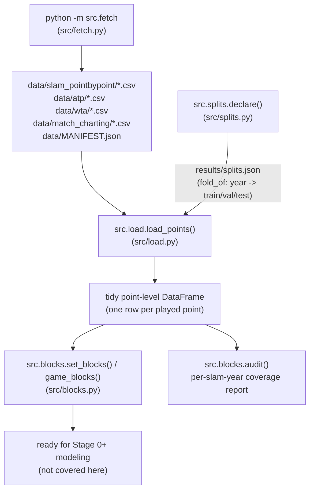

# Data pipeline

*A walkthrough of everything that happens between "empty `data/` directory" and
"analysis-ready point-level DataFrame." This covers `fetch → load → splits →
blocks` only — not the Stage 0 statistics or any modeling code.*

## Overview

This project estimates tennis player ability from Grand Slam point-by-point
data, so the pipeline exists to turn a set of CSV files scattered across a
third-party GitHub mirror into one tidy table of played points, with a frozen
train/val/test split and a blocking scheme ready for the modeling stages. Four
modules do this in strict order: `src/fetch.py` downloads and hash-verifies the
raw corpus into `data/` (never committed to git); `src/load.py` reads the
slam point-by-point CSVs, harmonizes their schema, filters out non-played
"sentinel" rows, and derives a few columns (tour, fold, tiebreak flag);
`src/splits.py` declares — once, durably, by year — which slam-years are
train/val/test; and `src/blocks.py` aggregates points into service blocks
(the unit the Stage 0+ statistics actually operate on) and produces a
per-slam-year audit for sanity-checking coverage and missingness before
anything gets pooled. `src/util.py` is not pipeline logic itself but the
shared plumbing (atomic JSON writes, append-only logs) that makes every stage
resumable after a killed session.

The dominant theme across all four modules is **provenance and non-random
missingness are treated as first-class facts, not swept under the rug**: every
fetched byte is hash-verified, every schema gap is recorded rather than
silently dropped, and the split/audit outputs are the thing a downstream
analyst is expected to read before trusting a number.

## Pipeline flow



Execution order in practice:

1. `python -m src.fetch` — populate `data/` (once; re-run is idempotent).
2. `src.splits.declare()` — write `results/splits.json` (once, ever).
3. `src.load.load_points(folds=...)` — read CSVs, harmonize, filter, tag with
   fold.
4. `src.blocks.set_blocks(...)` / `audit(...)` — aggregate into the unit the
   statistics use, and sanity-check coverage before trusting anything.

---

## 1. Fetch — `src/fetch.py`

### What it does

`src/fetch.py` is, per its own docstring, **"the only sanctioned way data
enters the project."** It downloads four data groups into `data/` and writes a
`data/MANIFEST.json` recording exactly what was fetched, from where, and its
SHA-256.

The four groups (`GROUPS` dict, fetch.py:177-186):

| Group | Contents | Role |
|---|---|---|
| `slam` | Grand Slam point-by-point `*-points.csv` + `*-matches.csv`, 2011-2024 | **Primary** dataset |
| `atp` | Men's match results, rankings, players | Retirement labels (Stage 0.5 positive control), ranking covariates |
| `wta` | Women's equivalent | Replication / generalization |
| `mcp` | Match Charting Project shot-by-shot | Separating strategic vs. involuntary contamination |

Run it with:

```bash
python -m src.fetch                 # fetch every group (~450 MB)
python -m src.fetch slam atp        # fetch a subset
python -m src.fetch --list          # show the file plan without downloading
python -m src.fetch --verify        # re-hash local files against MANIFEST; hard stop on mismatch
python -m src.fetch --source hf     # fetch via the Hugging Face fallback
```

### Why: the provenance problem

The three JeffSackmann repos named in the project spec
(`tennis_slam_pointbypoint`, `tennis_atp`, `tennis_wta`) **return 404 as of
September 2026** (fetch.py:19-27). `slam`/`atp`/`wta` are instead pulled from
an archival mirror, `Aneeshers/tennis-sackmann-archive`, pinned to a full
40-character commit SHA (`MIRROR_SHA`, fetch.py:77). The Match Charting
Project is still live upstream and is pulled directly from JeffSackmann,
pinned to its own SHA (`MCP_SHA`, fetch.py:79).

This matters because **the mirror is an archive, not a fork** — it shares no
git history with the original repos, so its contents can't be diffed against
what upstream actually published. A commit pin to a third party isn't
self-verifying if that third party also disappears. So the script's real
integrity anchor is not the commit pin — it's a **SHA-256 recorded per file**
in `data/MANIFEST.json`, checked before the file is trusted. A guard at import
time (fetch.py:189-194) asserts `slam`/`atp`/`wta` always come from the
mirror repo, so an edit that accidentally re-points at a dead
`JeffSackmann/...` URL fails loudly instead of silently breaking provenance.

Provenance quality is **uneven and the code says so** (the `SOURCES` dict,
fetch.py:89-126, written verbatim into the manifest): `slam` names its
upstream commit (`6febb77`, abbreviated because the full SHA is unrecoverable
now that upstream is gone) — rated `"good"`. `atp` and `wta` are a June 2026
snapshot with **no recorded upstream commit** — rated `"WEAK — ... trust
risk"`. `mcp` is pinned directly to a live upstream commit — `"good"`.

### The `--verify` hard stop

`fetch_group()` (fetch.py:267-313) and `verify()` (fetch.py:316-346) both
treat a hash mismatch as fatal, never a warning:

- On a fresh download, if the manifest already has a recorded hash for that
  path and the newly-downloaded bytes don't match it, `fetch_group` raises
  `SystemExit` — "Hard stop" (fetch.py:297-300).
- If a file already exists on disk at the expected size, it's re-hashed and
  compared against the manifest; a mismatch also raises `SystemExit` rather
  than silently re-trusting stale bytes (fetch.py:283-291). This is also what
  makes fetch **idempotent**: a file already present whose hash matches is
  skipped, so a partial run resumes cleanly.
- `python -m src.fetch --verify` re-hashes *every* file in the manifest
  against its recorded SHA-256, independent of any download. Any mismatch or
  missing file returns exit code 1 (fetch.py:340-344) — this is meant to be
  run any time you want to trust what's on disk (e.g., before a long modeling
  run).

### The Hugging Face fallback

`HF_REPO`/`HF_REVISION` (fetch.py:83-84) point at the same archive mirrored on
the Hugging Face Hub. It's a **second fallback**, reachable via
`--source hf`, but it's "usable ONLY when its bytes reproduce our recorded
hashes" (fetch.py:33-34) — i.e., it goes through the exact same hash-check
path as the GitHub download, so switching source never silently swaps in
different data. `mcp` has no HF fallback (`_url_for`, fetch.py:242-243) since
the charting project isn't in that archive.

### Singles-only filtering and the 2011-2024 window

The slam directory mixes singles, `-doubles`, and `-mixed` files.
`_is_slam_singles()` (fetch.py:142-147) explicitly excludes anything with
`"doubles"` or `"mixed"` in the name and only keeps files matching
`20\d\d-\w+-(points|matches)\.csv` — so a later accidental glob can't pull in
doubles data. `_is_tour_window()` (fetch.py:150-165) does the analogous job
for `atp`/`wta`: it excludes `_doubles_`, `_futures_`, `_qual_chall_`, and
`_amateur_` files, and restricts `atp_matches_YYYY.csv` / `wta_matches_YYYY.csv`
to `WINDOW = range(2011, 2025)` (fetch.py:128) — the same span the slam
point-by-point data covers, so downstream joins (e.g., retirement labels)
don't need to worry about mismatched years.

### Provenance/licensing output

Every successful fetch writes three files into `data/`
(`write_provenance()`, fetch.py:349-382):

- **`MANIFEST.json`** — generation timestamp, the pinned SHAs, per-group
  `SOURCES` metadata, explicit `provenance_notes` (archive-not-fork, weak
  atp/wta provenance, "keep an independent cold copy," and the frozen-dataset
  note), and a `files` list with one record per file: group, relative path,
  size, SHA-256, source, and both the GitHub and HF URLs it could have come
  from.
- **`ATTRIBUTION.txt`** and **`DATA_LICENSE.txt`** — the CC BY-NC-SA 4.0
  attribution text (Jeff Sackmann as compiler, non-commercial only,
  share-alike) and full license summary, written verbatim
  (fetch.py:385-430). The grant is irrevocable, so using the archived copies
  is legitimate even though upstream is gone.

`data/` itself is **gitignored** — nothing under it is ever committed; this is
enforced by `.gitignore`, not by the fetch script, but the fetch script's
docstring calls this out as the reason hashes/manifests matter so much
(fetch.py:3-6). See `data/MANIFEST.json` in the repo for the current fetched
state (141 files, ~447 MB as of the last fetch).

---

## 2. Load — `src/load.py`

### What it does

`src/load.py` reads the singles point-by-point CSVs and turns them into one
tidy DataFrame, one row per **played** point, from the server's perspective.

```bash
python -c "from src import load; df = load.load_points(folds=('train',)); print(df.shape)"
```

Key entry points:

- `singles_point_files()` (load.py:55-58) — lists every `*-points.csv` under
  `data/slam_pointbypoint/`, filtered through `_POINTS_RE` (`^(\d{4})-([a-z]+)-points\.csv$`)
  so doubles/mixed files (which don't match that pattern) can never enter,
  even if a later glob is looser.
- `load_points_file(path, decl=None)` (load.py:84-141) — loads and harmonizes
  one file.
- `load_points(folds=None, years=None)` (load.py:144-162) — loads across all
  matching files and concatenates.

### Why: schema harmonization by meaning, not name

The output columns are fixed (`match_id, slam, year, tour, fold, set_no,
game_no, point_no, server, returner, server_wins, serve_number,
is_tiebreak`), but the *source* column names and availability vary by
slam/year — this is the D6 ("instrumental contamination") concern from
`tennis-contamination.md`: "same quantity, different column across events" and
"schema grows over time." `load.py` handles this by splitting columns into two
tiers (load.py:46-50):

- **`CORE`** — `match_id, SetNo, GameNo, PointNumber, PointServer,
  PointWinner`. These are asserted present; `load_points_file` raises
  `ValueError` if any are missing from a file's header (load.py:91-93).
- **`OPTIONAL`** — `ServeNumber, P1GamesWon, P2GamesWon`. These are read if
  present and otherwise filled with `pd.NA` / a default, never dropped and
  never treated as an error (load.py:128-138). `ServeNumber` is a concrete
  example: it's absent in 2011, so `serve_number` becomes a
  **reduced-covariate** (`NaN`) for those rows rather than triggering a row
  drop or being read as evidence of contamination — directly implementing the
  CLAUDE.md trap "Treat an absent column as a signal → D6, not
  contamination."

### Sentinel filtering

`PointServer`/`PointWinner` use `0` to mark warmup or unknown-server points
(`PointNumber` values like `"0X"`/`"0Y"`). `load_points_file` computes
`played = server.isin([1, 2]) & winner.isin([1, 2])` and keeps only those rows
(load.py:99-105) — sentinel rows are dropped before any rate is computed,
which matters because CLAUDE.md flags "check sentinel/zero encodings for
unknown server/winner before trusting any rate" as a specific trap.

Retirement/walkover truncation is explicitly **not** filtered — a short match
is kept as-is, because it's the Stage 0.5 positive control
(load.py:13-14, mirroring the CLAUDE.md trap table entry "Drop retirements as
bad data → Retirement lead-up is the Stage 0.5 positive control").

### Deriving `tour` from `match_num`

Slam points/matches files carry both men's and women's singles in the same
directory. `_match_meta()` (load.py:61-81) derives `tour` from the match-number
convention: `match_num` starting with `"1"` → `"M"`, starting with `"2"` →
`"W"` — a convention present in every year. `event_name` ("Men's
Singles"/"Women's Singles") is used as a cross-check only where it happens to
be populated (early years), since it isn't reliably present. This matters
because serve dominance (~64-65% men vs. high-50s% women) and match length
(best-of-5 vs. best-of-3) differ by tour, so conflating them would leak a
tour effect into whatever the model is trying to measure.

### Player identity = canonical name key

Slam matches files **do not populate player IDs**, so within this corpus a
player's identity is derived from the `player1`/`player2` name strings. But the
corpus is inconsistent: it uses full names ("Dominic Thiem", ~2011–2018) and
initial+surname ("D. Thiem", ~2019+), which fragments a player across years and
breaks the ATP/WTA join. `load.canonical_name` normalizes every name to a
single key — accent- and punctuation-stripped, lowercased **first-initial +
surname** ("Dominic Thiem" and "D. Thiem" → `"d thiem"`) — and `_match_meta`
applies it, so `server`/`returner` carry the canonical identity everywhere
(load.py `canonical_name`, applied in `_match_meta`). This is the D6
name-normalization the spec demands; Stage 0.5's ATP/WTA retirement join uses
the same key. Residual risk: two distinct players sharing an initial+surname
collide (rare in slam singles) — audit, don't trust blindly.

### `is_tiebreak`

Derived from `P1GamesWon == 6 and P2GamesWon == 6` at the point's game score
(load.py:133-138) — i.e., the game being played at 6-6 in a set. This flag is
what lets `src/blocks.py` decide whether to keep or exclude tiebreak points
depending on block granularity (see below). If `P1GamesWon`/`P2GamesWon`
aren't present, `is_tiebreak` defaults to `False` for every row in that file.

### Fold assignment

Every row gets a `fold` column via `splits.fold_of(year, decl)`
(load.py:120), so the train/val/test label is attached at load time, not
inferred later.

### The `folds=` guard

`load_points(folds=None, years=None)` accepts a `folds` tuple (e.g.
`("train",)` or `("train", "val")`). When given, **files for years outside
those folds are never read** (load.py:154-158) — this is the mechanism that
keeps Stage 0 analysis physically off the test set; it's not just a
post-hoc filter on a fully-loaded DataFrame, the test-year CSVs are skipped
at the file-selection stage.

---

## 3. Splits — `src/splits.py`

### What it does

Declares the train/validation/test split **once**, by year, and persists it
durably to `results/splits.json` so it can't be silently redefined later.

```bash
python -c "from src import splits; print(splits.declare())"
```

The declaration (splits.py:25-27):

| Fold | Years | Note |
|---|---|---|
| `train` | 2011-2018 | all four slams every year |
| `val` | 2019-2020 | 2020 missing Wimbledon (cancelled) |
| `test` | 2021-2024 | 2021 has all four slams; 2022-2024 have only two each |

`declare(force=False)` (splits.py:57-68) writes this to
`results/splits.json` via `util.write_json` the **first** time it's called,
and on every subsequent call just returns what's already on disk — it refuses
to overwrite unless `force=True` is passed explicitly. `load()` (splits.py:71-77)
reads the persisted declaration and raises `FileNotFoundError` if it hasn't
been declared yet, rather than silently deriving one. `fold_of(year, decl)`
(splits.py:80-88) is the lookup used throughout `load.py` and elsewhere.

### Why: by-year is match-clean, and it's the only OOS period there will ever be

CLAUDE.md's first non-negotiable is "split by match and by time, never by
point" — ability drifts, so training on early years and testing on late years
respects that drift instead of leaking future ability backward. Splitting at
**year boundaries** gets match-cleanliness for free: a match is played within
a single slam-year, so a boundary between years can never cut a match in half
(splits.py:6-7).

The `RATIONALE` string (splits.py:29-39, also persisted into the JSON) records
the consequence of the known coverage gap: because 2022-2024 carry only two
slams a year instead of four, the late test years skew toward whatever
surfaces those two slams happen to be (grass/hard), so **raw rates should
never be compared across folds without conditioning on slam × year fixed
effects** — this is the practical instruction the rest of the pipeline (and
modeling code) needs to respect.

The **frozen-dataset consequence**: slam point-by-point data ends October
2024 and will never be extended, so this test fold is "the only
out-of-sample period this project will ever have" (splits.py:8-11,
also stored under the `frozen_dataset` key in the JSON). That's why the
declaration is write-once — there's no opportunity to fix a bad split by
re-drawing it later without contaminating the one shot at genuine OOS
evaluation. Stage 0 fits on train and measures the noise floor on val; test
is reserved for the final mixture-vs-single-component comparison.

---

## 4. Blocks — `src/blocks.py`

### What it does

Aggregates point-level rows into **service blocks** — the actual unit that
the Stage 0+ statistics operate on — and produces a per-slam-year audit
report.

```bash
python -c "
from src import load, blocks
df = load.load_points(folds=('train',))
sb = blocks.set_blocks(df)
print(sb.head())
print(blocks.audit(df))
"
```

Three functions:

- **`set_blocks(points)`** (blocks.py:20-26) — groups by
  `(match_id, slam, year, tour, fold, set_no, server)` and aggregates
  `server_wins` into `n` (points served), `wins`, and `rate`. This is
  **the Stage 0 default unit**.
- **`game_blocks(points)`** (blocks.py:29-36) — groups by
  `(match_id, slam, year, tour, fold, set_no, game_no, server)`, first
  dropping tiebreak points. **Diagnostics only.**
- **`audit(points)`** (blocks.py:39-68) — one row per `(slam, year, tour)`
  summarizing coverage and missingness.

### Why: set-level blocks by default, games for diagnostics only

This directly implements the CLAUDE.md trap "Block at game level (server is
constant!) → ~6-8 points; SD ≈ 0.18. Conceptually clean, statistically
hopeless. Default to set-level (~30-35 points, SD ≈ 0.08)." At
`p ≈ 0.63` serve-win rate, a set-level block's rate has SD ≈ 0.08, so a
20-percentage-point collapse in serve-win rate is about 2.5 SD — detectable in
aggregate. A game-level block's SD (≈0.18) makes the same collapse barely 1
SD — "conceptually clean" (the server really is constant within a game) but
statistically underpowered (blocks.py:3-8).

**Tiebreak handling differs by granularity for a structural reason**:
`game_blocks` excludes tiebreak points because a tiebreak breaks the
one-server-per-game invariant that game-level blocking relies on (serve
alternates *within* a tiebreak game). `set_blocks` keeps tiebreak points
because it groups by the point's *actual* server column, not by an assumed
constant game server, so there's no invariant to break (blocks.py:6-8).

Per the module docstring (blocks.py:10-12) and the CLAUDE.md trap table,
**per-block labels are explicitly not the deliverable** — later EM fitting
recovers ε from the aggregate shape of the block-rate distribution across
many blocks, not by classifying any individual block as contaminated or not.
`blocks.py` only produces the blocks; it doesn't attempt to label them.

### The per-slam-year audit

`audit()` returns one row per `(slam, year, tour)` with (blocks.py:39-68):

- `fold` — which split this slam-year belongs to.
- `n_matches`, `n_points`, `n_set_blocks` — coverage/volume.
- `serve_win_rate` — raw service-point win rate for that slam-year-tour.
- `serve_number_missing_frac` — fraction of points with no `serve_number`
  (i.e., how much of that slam-year is reduced-covariate for first/second
  serve).
- `tiebreak_point_frac` — fraction of points that are tiebreak points.
- `points_per_match_median`, and `points_per_set_block_median`/`p10`/`p90` —
  distributional sanity checks on block size.

This exists because of the D6 concern from `tennis-contamination.md`: schema
availability and raw serve rates can move by slam × year for reasons that have
nothing to do with player ability (surface changes, recording coverage
changes, schema additions over time), and if that's not checked before
pooling, it "loads onto the contamination component" — i.e., produces a false
positive for ε. The audit is the tool for running the "key diagnostic" the
spec calls for: does anything (missingness, schema version, slam) track more
strongly than player identity? The audit table is what you'd inspect to
answer that before trusting any pooled number.

---

## 5. Util — `src/util.py`

Not a pipeline stage itself, but the shared I/O plumbing every stage above
(and later modeling stages) depends on. Two things worth knowing:

- **Atomic JSON writes** — `write_json(path, obj)` (util.py:32-44) writes to a
  temp file in the same directory and then `os.replace()`s it into place,
  rather than writing directly to the destination. This means a crash or a
  killed session mid-write can never leave a half-written JSON file that a
  later run might mistake for a valid, complete checkpoint (util.py:5-6).
  `splits.py`'s `results/splits.json` goes through this path.
- **Append-only JSONL** — `append_jsonl(path, obj)` (util.py:51-55) opens in
  append mode and writes one JSON record per line, never rewriting the file.
  This is the mechanism behind things like the trial log (CLAUDE.md: "Log
  every model variant tried... append to a trial log; never reset it") —
  by construction, you can't accidentally truncate history by re-running
  something.

Both exist for the same reason: everything a stage produces is written to
`results/` as it's computed, so a session that dies mid-run (out of usage,
crash) loses nothing — "a fresh run reads what is on disk and continues"
(util.py:1-6). This is what makes `fetch.py`'s idempotent re-download and
`splits.py`'s write-once declaration both safe to invoke repeatedly without
risking silent corruption or redefinition.

---

## 6. Processed layer — `src/build_processed.py`

**What it does.** Materializes the whole normalized pipeline into a clean,
regenerable analysis layer under `data/processed/` so nothing downstream ever
has to re-derive it (or re-hit the name-fragmentation bug) from raw. Raw is
never modified — it stays byte-for-byte as fetched and `--verify`-able; the
processed layer is derived and fully rebuildable.

**Outputs** (all gitignored, like the rest of `data/`):
`points.parquet` (1.9M rows, canonical names, all folds), `slam_matches.parquet`,
`tour_slam_matches.parquet` (ATP+WTA slam results with `is_ret`/`is_walkover`,
ranks, surface — the label source for Stage 0.5 and the weak-player test),
`name_crosswalk.parquet` (every raw name → canonical), `BUILD.json` (provenance:
raw source SHAs + counts), and `README.md` (data dictionary). A small committed
summary lands in `results/processed_build.json`.

**Why (the trap it closes).** `load.canonical_name` fixes name fragmentation at
read time, but any code that opens the raw CSVs directly hits it again. This
layer bakes the fix in. **Prefer `load.load_processed_points()`** over
re-deriving from raw.

**True name collisions.** The crosswalk's collision audit found ~9 canonical
keys that merge *distinct* players (twins/siblings/same-initial pairs — e.g.
`k pliskova` = Karolina **and** Kristyna, `a rodionova`, `x wang`). For these,
initial-only records are inherently ambiguous (the corpus dropped the first
name), so rows carry `ambiguous_identity = True` (~2.3% of points) instead of
being silently merged. Curated in `build_processed.KNOWN_COLLISIONS`; re-review
the audit's flagged list on each build.

**Command.** `python -m src.build_processed`

---

## Known gaps / caveats

- **Coverage is uneven across 2011-2024, and gets worse toward the end.**
  2011-2019 and 2021 carry all four slams per year; 2020 is missing Wimbledon
  (cancelled); **2022-2024 carry only two slams each** in the current
  snapshot. This directly skews the test fold (2021-2024) toward whichever
  surfaces those later years' two slams happen to be. Always check
  `blocks.audit()` output for the slam-years you're actually using before
  trusting a sample size, and never compare raw rates across folds without
  slam × year fixed effects.
- **Name-normalization / D6 risk on cross-corpus joins.** `load.py` uses raw
  name strings (`player1`/`player2`) as player identity within the slam
  corpus because slam matches files don't populate player IDs. Joining to ATP
  (for retirement labels, ranking covariates) requires name matching across
  corpora, and accents/hyphenation/name changes fail non-randomly — this is
  explicitly deferred to Stage 0.5, not handled in `load.py`, and
  `tennis-contamination.md` calls out that the unmatched set needs auditing,
  not dropping.
- **`atp`/`wta` provenance is weak.** Unlike `slam` (which names its upstream
  commit) and `mcp` (pinned live), the `atp`/`wta` groups come from a June
  2026 mirror snapshot with **no recorded upstream commit SHA** — `fetch.py`
  and `data/MANIFEST.json` both flag this as a "known trust risk," not
  something silently assumed away. Any conclusion resting heavily on ATP/WTA
  data (retirement labels, rankings) inherits that weaker provenance.
- **The corpus is frozen.** Slam point-by-point data ends October 2024; there
  will be no future data to extend or re-validate against. The test fold
  declared in `results/splits.json` is the only out-of-sample period this
  project will ever get, which is why `splits.declare()` refuses to
  overwrite an existing declaration without an explicit `force=True`.
