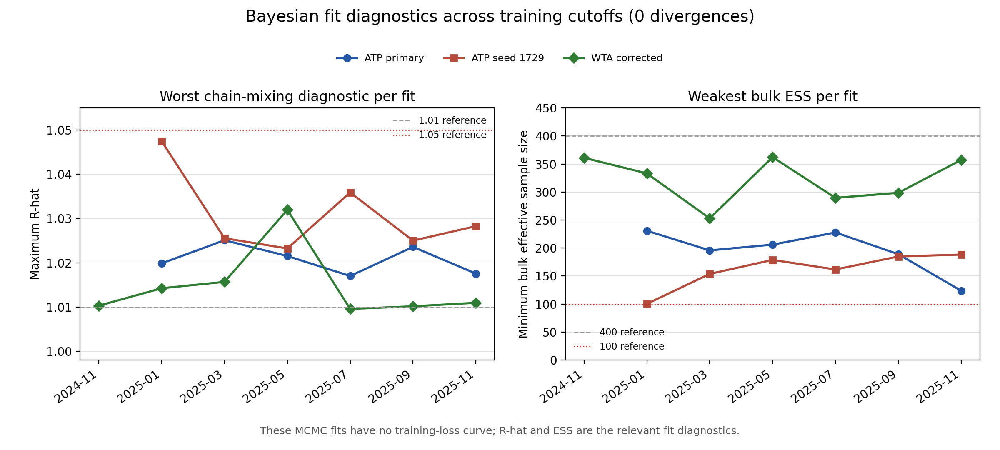
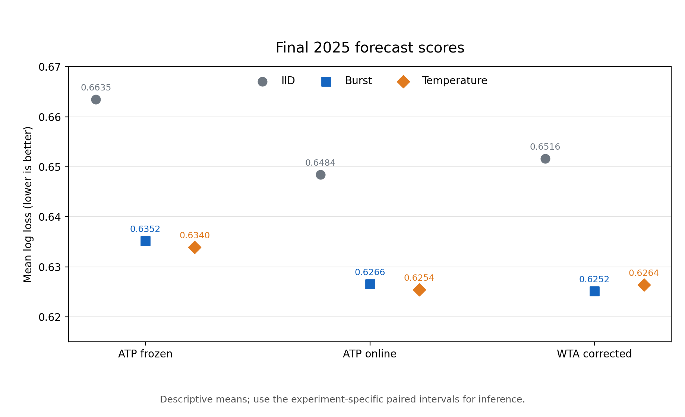

# Important plots

This directory is the compact visual index for the final experiments. Run
`python plots/make_plots.py` from the repository root to rebuild it from the
canonical result files. `manifest.json` records every source and SHA-256.

There is no conventional training-loss curve: the models are Bayesian MCMC
fits rather than gradient-trained predictors. [`fit_diagnostics.png`](fit_diagnostics.png)
shows the relevant training diagnostics—maximum R-hat, minimum bulk effective
sample size, and total divergences—at every ATP and WTA cutoff.

## Overview

| Plot | What it shows |
|---|---|
| [Fit diagnostics](fit_diagnostics.png) | Chain mixing and effective sample size across all final 2025 fits and the independent seed rerun. |
| [Forecast log loss](forecast_log_loss.png) | One-page comparison of iid, burst, and temperature forecasts for ATP frozen, ATP online, and corrected WTA 2025. |
| [ATP frozen holdout](atp_frozen_holdout.png) | Frozen ATP season score, paired gains, and monthly drift. |
| [ATP online updates](atp_online_updates.png) | Frozen versus bimonthly updated ATP forecasts. |
| [MCMC seed replication](mcmc_seed_replication.png) | Original and seed-1729 scores and paired comparisons. |
| [Burst versus temperature by format](burst_vs_temperature_by_format.png) | Best-of-three and best-of-five mechanism comparison. |
| [Burst versus temperature by edge](burst_vs_temperature_by_edge.png) | Mechanism comparison across forecast edge sizes. |
| [Corrected WTA holdout](wta_corrected_holdout.png) | Final WTA protocol-corrected forecast comparison. |
| [Point dependence](point_dependence.png) | Direct serial association and set-level overdispersion. |
| [Point-structure follow-up](point_structure_followup.png) | Set-centering and lag-structure sensitivity. |

The overview log-loss plot intentionally omits absolute-season error bars.
Model inference should use the paired tournament and player-tournament
intervals shown in the experiment-specific figures and result JSON files.

