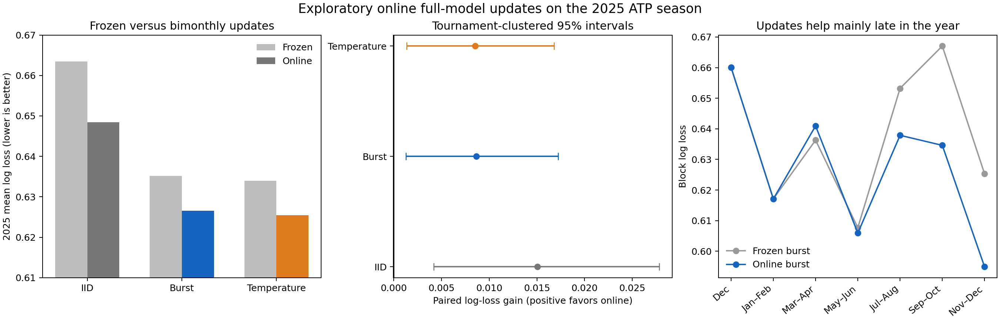

# Exploratory online updates: 2025

> The frozen 2025 holdout had already been scored before this extension was registered. These online results are exploratory.

## Result

Bimonthly ability updates improve every forecast family. Online burst log loss is **0.62656**, down from 0.63521 with frozen abilities. Temperature scaling remains fractionally better, so the result continues to support calibration rather than a uniquely burst-driven mechanism.

| Forecast | Frozen log loss | Online log loss | Frozen accuracy | Online accuracy |
|---|---:|---:|---:|---:|
| IID | 0.66348 | 0.64844 | 0.6337 | 0.6442 |
| Burst | 0.63521 | 0.62656 | 0.6337 | 0.6431 |
| Temperature | 0.63396 | 0.62544 | 0.6337 | 0.6442 |

Positive paired gain favors the first method:

- Online burst vs frozen burst: **+0.00865**, tournament CI [+0.00128, +0.01721], player-tournament CI [-0.00230, +0.02057].
- Online burst vs online iid: **+0.02188**, tournament CI [+0.01508, +0.02895], player-tournament CI [+0.00942, +0.03437].
- Online burst vs online temperature: **-0.00112**, tournament CI [-0.00341, +0.00078].

## Update blocks

| Forecast block | n | Frozen burst | Online burst | Online gain |
|---|---:|---:|---:|---:|
| Dec | 82 | 0.66004 | 0.66004 | +0.00000 |
| Jan–Feb | 495 | 0.61709 | 0.61709 | -0.00000 |
| Mar–Apr | 480 | 0.63630 | 0.64095 | -0.00465 |
| May–Jun | 572 | 0.60771 | 0.60595 | +0.00175 |
| Jul–Aug | 542 | 0.65322 | 0.63788 | +0.01534 |
| Sep–Oct | 415 | 0.66705 | 0.63460 | +0.03245 |
| Nov–Dec | 84 | 0.62533 | 0.59494 | +0.03039 |

The December and January–February rows reuse the original posterior exactly. The March update is slightly worse and May is nearly neutral. The aggregate gain comes from the July, September, and November refits, when frozen abilities have become stale.

## Diagnostics and provenance

Every cutoff fingerprint matches exactly the observations strictly before its forecast period. All six fits used four chains, 1,000 warmup draws, and 1,000 retained draws.

There were 0 divergences. Max R-hat was 1.025 and minimum bulk ESS was 124. Every fit exceeds the strict 1.01 R-hat guideline, while none exceeds 1.05. The weakest ESS is in the November fit.

A second burst-simulation seed changed mean probabilities by 0.00210 and online burst log loss from 0.62656 to 0.62660.

## Files

- `PROTOCOL_ONLINE_POSTHOC.md`: fixed exploratory update protocol.
- `ONLINE_FROZEN.json`: hashes and carried settings.
- `online_results.json`: complete metrics and clustered intervals.
- `online_predictions_2025.csv`: match-level online and frozen forecasts.
- `online_periods.csv`: block-level decomposition.
- `fits/ordinary_period_84.json` through `ordinary_period_89.json`: fit diagnostics.
