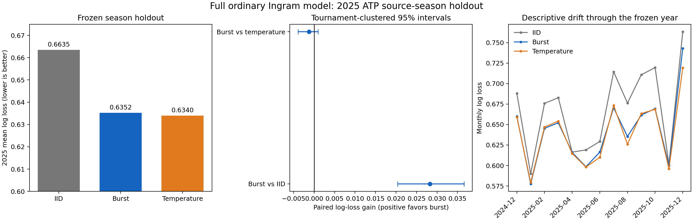

# Ordinary full model: frozen 2025 holdout

## Result

The burst forecast clearly improves the uncalibrated iid forecast, but it does not beat the simpler temperature control. This supports probability shrinkage and does not isolate within-match bursts as the source of the gain.

| Frozen forecast | 2025 log loss | Accuracy | Brier | Calibration slope |
|---|---:|---:|---:|---:|
| IID | 0.66348 | 0.6337 | 0.23067 | 0.525 |
| Burst | 0.63521 | 0.6337 | 0.22257 | 0.767 |
| Temperature | 0.63396 | 0.6337 | 0.22241 | 0.788 |

Positive paired gain favors burst:

- Burst vs iid: **+0.02827**, tournament CI [+0.02036, +0.03660], player-tournament CI [+0.01550, +0.04191].
- Burst vs temperature: **-0.00125**, tournament CI [-0.00390, +0.00093], player-tournament CI [-0.00491, +0.00182].

## Tournament appearances

| Appearance stratum | n | IID | Burst | Temperature | Burst gain vs iid |
|---|---:|---:|---:|---:|---:|
| both_first | 1159 | 0.69164 | 0.66051 | 0.65847 | +0.03113 [+0.02034, +0.04278] |
| mixed_first_later | 385 | 0.63116 | 0.60368 | 0.60507 | +0.02748 [+0.01058, +0.04358] |
| both_later | 1075 | 0.64479 | 0.61879 | 0.61782 | +0.02600 [+0.01205, +0.04227] |
| unknown | 51 | 0.66178 | 0.64440 | 0.63535 | +0.01739 [+0.01076, +0.02387] |

## Scope and diagnostics

This is a one-shot season holdout. One full posterior was trained on 35,732 eligible 2011–2024 matches, then held fixed for all 2,670 matches in the 2025 source season. The burst rate 0.5 and temperature 1.5 were carried from the independently tuned 2013 configuration. There was no 2025 tuning.

The fit had zero divergences, max R-hat 1.020, and minimum bulk ESS 231. The R-hat exceeds the strict 1.01 guideline but remains below 1.05. A second simulation seed changed mean probabilities by 0.00208 and burst log loss from 0.63521 to 0.63547.

Because abilities are not refreshed during 2025, the 0.63521 burst score is not directly comparable to the earlier bimonthly-updated 2014 score of 0.58087. The monthly panel is descriptive and shows the cost of stale abilities later in the year.

## Exploratory online extension

After this frozen holdout was scored, five additional full posterior fits updated abilities at the March, May, July, September, and November cutoffs. Online burst log loss fell to **0.62656** and accuracy rose to **0.6431**. The paired online-versus-frozen burst gain was +0.00865, with tournament CI [+0.00128, +0.01721] and player-tournament CI [-0.00230, +0.02057]. Online temperature remained nominally best at 0.62544. The online analysis is exploratory because the 2025 outcomes had already been opened. See [`ONLINE_README.md`](ONLINE_README.md) for its fixed protocol, period-level results, diagnostics, and figure.

The post-hoc [mechanism split](mechanism_splits/README.md) finds no edge-size
band where burst beats temperature. Best-of-three is effectively tied;
best-of-five favors temperature, including after temperatures are fitted
separately by format on 2013. The independent MCMC seed replication under
`mcmc_seed_1729/` reproduces the season scores closely: burst 0.62662,
temperature 0.62554, and paired gain -0.00109 [-0.00322, +0.00072]. Its weak
R-hat/ESS diagnostics confirm that the nominal 0.001 ordering is unresolved.

## Files

- `PROTOCOL.md`: frozen design and pre-test amendment.
- `FROZEN_BEFORE_2025.json`: sealed forecast settings and hashes.
- `results.json`: complete metrics and clustered intervals.
- `predictions_2025.csv`: match-level forecasts.
- `strata.json` and `monthly.csv`: report-derived summaries.
- `fits/ordinary_period_84.json`: posterior configuration and diagnostics.
- `mechanism_splits/`: edge, format, and per-format-temperature comparisons.
- `MCMC_REPLICATE_PROTOCOL.md`: locked settings for the seed-1729 rerun.
