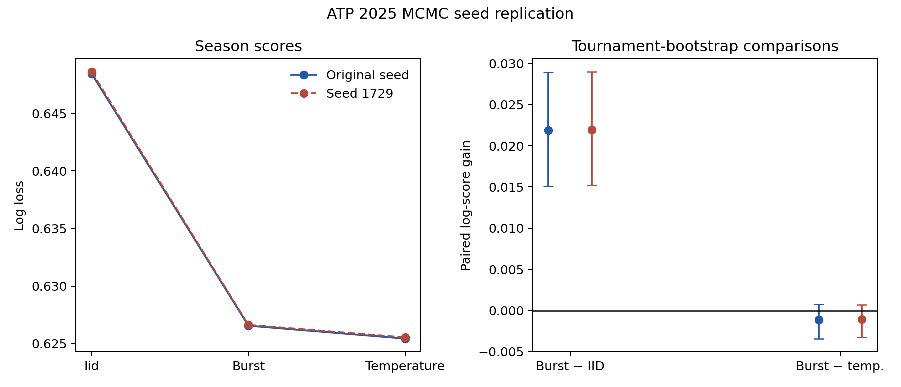

# ATP 2025 MCMC seed replication

Repeated all six online posteriors with NUTS seed 1729.

| Forecast | Log loss |
|---|---:|
| replicate_iid | 0.64860 |
| replicate_burst | 0.62662 |
| replicate_temperature | 0.62554 |

Paired log-score gains (positive favors first):

- replicate_burst_vs_replicate_iid: +0.02197; tournament CI [+0.01520, +0.02898]; player-tournament CI [+0.00947, +0.03436].
- replicate_burst_vs_replicate_temperature: -0.00109; tournament CI [-0.00322, +0.00072]; player-tournament CI [-0.00446, +0.00171].
- replicate_burst_vs_original_burst: -0.00007; tournament CI [-0.00037, +0.00025]; player-tournament CI [-0.00052, +0.00041].

Mean absolute burst-probability change: 0.00242.
Across fits: max R-hat 1.047, minimum bulk ESS 100, 0 divergences.

