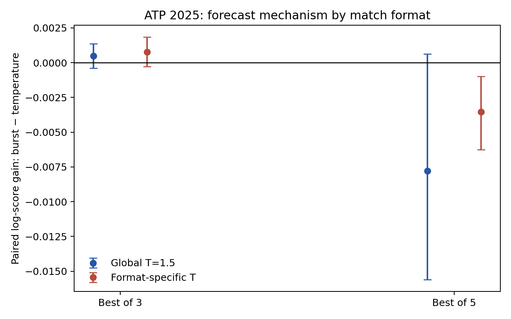
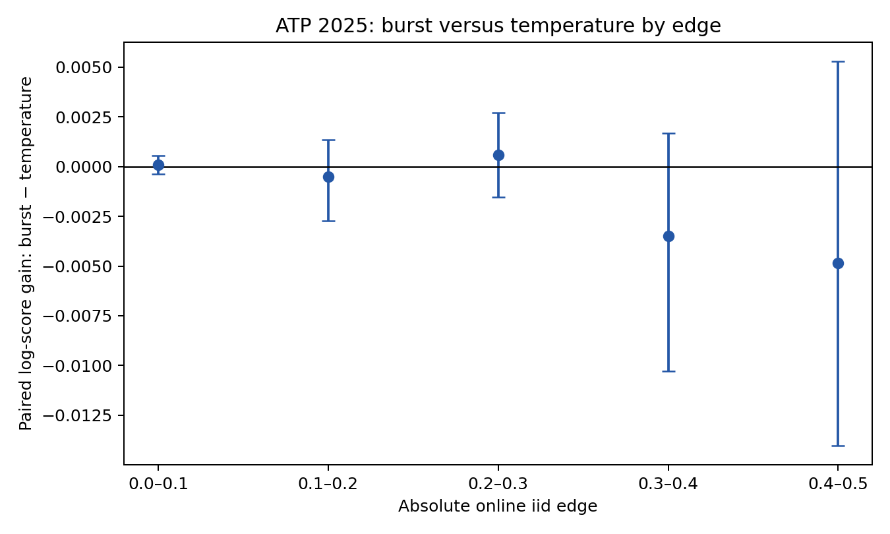

# Where does burst differ from temperature?

Post-hoc mechanism analysis of the already-opened ATP 2025 online forecasts. Positive paired log-score gain favors burst.

## Match format

| Format | n | 2013 format T | Burst vs global T | Burst vs format T |
|---|---:|---:|---:|---:|
| Best of 3 | 2154 | 1.479 | +0.00048 [-0.00039, +0.00137] | +0.00078 [-0.00027, +0.00184] |
| Best of 5 | 516 | 1.287 | -0.00779 [-0.01559, +0.00064] | -0.00354 [-0.00626, -0.00098] |

## Edge size

| abs(iid - 0.5) | n | Online burst vs temperature |
|---|---:|---:|
| 0.0–0.1 | 648 | +0.00010 [-0.00037, +0.00055] |
| 0.1–0.2 | 663 | -0.00050 [-0.00274, +0.00135] |
| 0.2–0.3 | 597 | +0.00059 [-0.00153, +0.00271] |
| 0.3–0.4 | 453 | -0.00349 [-0.01030, +0.00169] |
| 0.4–0.5 | 309 | -0.00484 [-0.01403, +0.00530] |

Intervals resample tournaments. The machine-readable result also includes player-tournament intervals and the frozen-model edge split.

