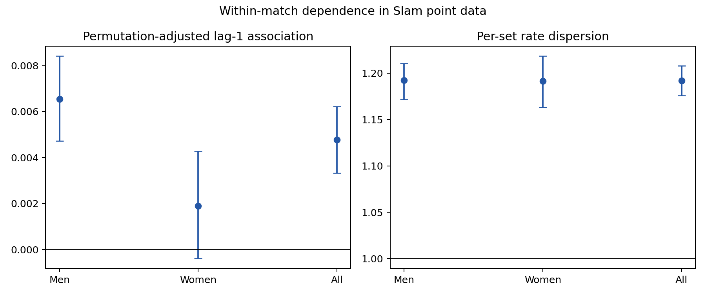

# Direct within-match point dependence

Analyzed 1,867,212 unambiguous Slam points. Intervals resample whole matches.

| Tour | Matches | Excess adjacent agreement | Adjusted lag-1 rho | Set-rate dispersion |
|---|---:|---:|---:|---:|
| Men | 5271 | +0.0027 [+0.0018, +0.0035] | +0.0065 [+0.0047, +0.0084] | 1.192 [1.172, 1.211] |
| Women | 4941 | +0.0004 [-0.0007, +0.0015] | +0.0019 [-0.0004, +0.0043] | 1.191 [1.163, 1.218] |
| All | 10212 | +0.0018 [+0.0012, +0.0025] | +0.0048 [+0.0033, +0.0062] | 1.192 [1.176, 1.208] |

Under conditionally iid points, both dependence measures equal zero and the set-rate dispersion ratio equals one. Conditioning on each match-server's total wins removes stable player, opponent, and surface differences. The estimates remain descriptive because tennis scoring and match stopping constrain observed sequences.

The subsequent [point-structure follow-up](../../analysis/point_structure_followup/README.md)
shows why that qualification matters. On the same men's within-set pairs,
set-centering reduces adjusted lag-one association from 0.00648 to 0.00264 and
the remaining player-event interval spans zero. A scoring-only iid control
also generates negative across-game association. These controls do not erase
the excess set-rate dispersion, but they prevent interpreting the raw serial
statistics as evidence of temporary physical impairment.

