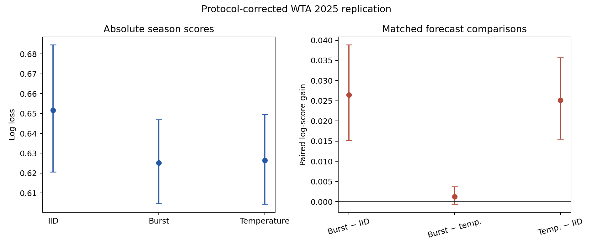

# Protocol-corrected WTA 2025 replication

This run enforces the frozen team-event exclusion after the initial implementation omitted it. See `../PROTOCOL_DEVIATION.md`.

Scored 2485 eligible WTA matches with chronological bimonthly updates.

| Forecast | Log loss | Accuracy | Brier | Calibration slope |
|---|---:|---:|---:|---:|
| iid | 0.65162 | 0.6491 | 0.22396 | 0.567 |
| burst | 0.62516 | 0.6487 | 0.21744 | 0.909 |
| temperature | 0.62644 | 0.6491 | 0.21763 | 0.851 |

Paired log-score gains (positive favors first):

- burst_vs_iid: +0.02646; tournament CI [+0.01526, +0.03887]; player-tournament CI [+0.00997, +0.04620].
- burst_vs_temperature: +0.00128; tournament CI [-0.00061, +0.00376]; player-tournament CI [-0.00141, +0.00536].
- temperature_vs_iid: +0.02518; tournament CI [+0.01550, +0.03566]; player-tournament CI [+0.01090, +0.04134].

Across fits: max R-hat 1.032, minimum bulk ESS 253, 0 divergences.
The burst simulation replicate changed probabilities by 0.00205 on average and log loss from 0.62516 to 0.62498.

